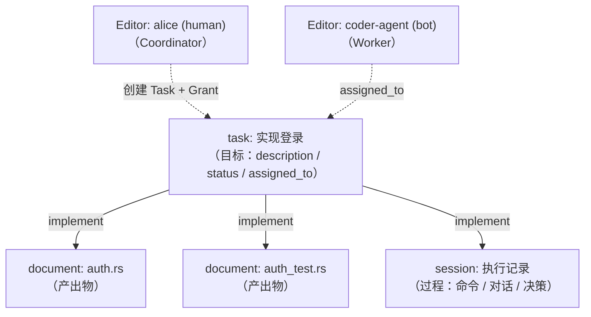
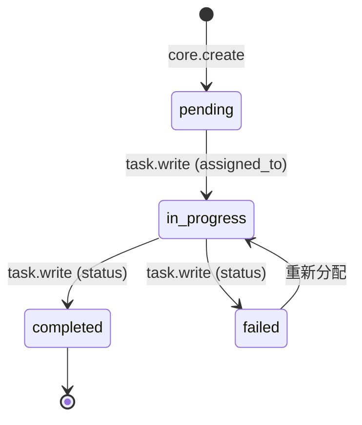
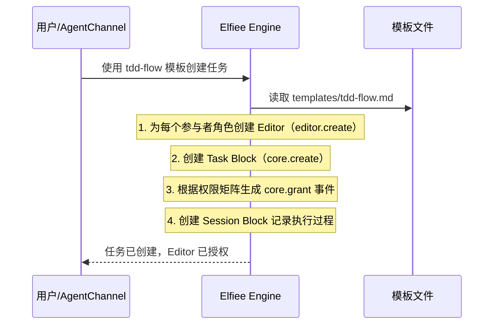
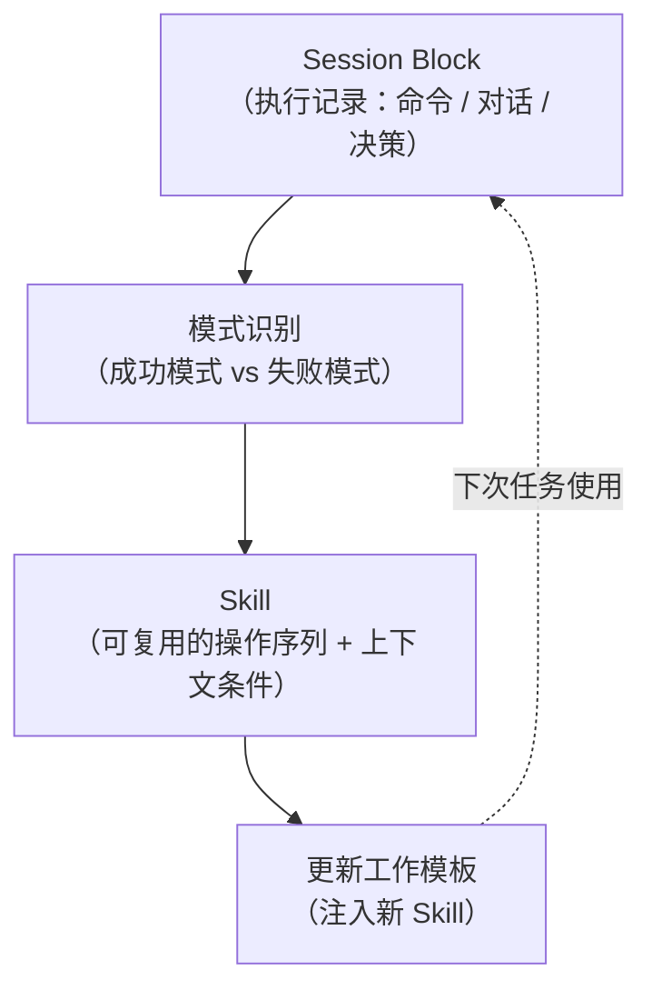
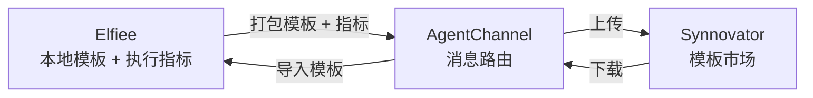

# Agent 创造与编排

> Layer 5 — 应用层，依赖 L4（extension-system）+ L1（cbac）。
> 本文档定义 Task Block 与 Session Block 的协作模型，工作模板系统（Socialware 声明），和 Skill 演化路径。

---

## 一、设计原则

**Elfiee 是 EventWeaver，不是 Agent 运行时。** Elfiee 不存储 Agent 的行为定义（prompt/provider/model），这些是 Agent 自身的事务。Elfiee 关心的是：谁（Editor）做了什么（Event），有没有权限做（CBAC）。人类和 Agent 在 Elfiee 中是平等的 Editor——这是 Socialware 身份平等原则的体现。

**产品理念契合：**
- **动作即资产**：Agent 执行任务的过程自动沉淀为 Session 记录。从 Session 中提炼 Skill，Skill 反馈给 Agent 改进——形成闭环
- **Agent Building**：工作模板定义参与者角色、权限矩阵、演化策略（Socialware 声明），是 Elfiee 的核心产品能力
- **Source of Truth**：所有操作（授权、工作过程、输出产物）都是 Event，可审计、可回溯

---

## 二、核心协作模型

### 2.1 Editor + Block 协作关系



**Editor 是唯一的身份模型。** 人类和 Agent 都是 Editor，通过 `editor.create` 注册、通过 `core.grant` 授权。Agent 的 prompt/provider/model 配置不在 Elfiee 中存储——这是 Agent 自身的事务。

| 实体 | 角色 | 在 Elfiee 中的表现 |
|---|---|---|
| **Editor（human）** | Coordinator / Reviewer | 创建 Task、分配权限、审查产出 |
| **Editor（bot）** | Worker / Tester | 接收任务、执行操作、记录过程 |
| **Task Block** | 工作分配的枢纽——"要做什么、谁来做、做到什么程度" | 随工作创建，状态流转后归档 |
| **Session Block** | 执行过程的记录——"怎么做的、说了什么、决定了什么" | 随 Task 创建，只追加不修改 |

### 2.2 Task 的状态流转



Task 的每次状态变更都是一个 Event。状态变为 `completed` 时触发 Checkpoint 快照（`event-system.md`），作为决策链的断点。

### 2.3 Session 的 append 语义

Session Block 不使用 write 操作，只使用 `session.append`：

| entry_type | 何时产生 | 包含什么 |
|---|---|---|
| `command` | Agent 在 AgentContext 中执行命令 | command、output、exit_code |
| `message` | Agent 与用户或其他 Agent 对话 | role（human/agent/system）、content |
| `decision` | Agent 做出关键决策 | action、related_blocks（关联的 Block） |

Session 的当前状态 = 所有 append 事件的有序合并。这使得 Session 成为完整的执行时间线，是 Skill 提炼和 Dogfooding 度量的数据源。

---

## 三、工作模板系统

### 3.1 模板的定位

工作模板存储在 `.elf/templates/` 目录中，定义多 Agent 协作的完整规格。模板是人类可读的文件（Markdown / TOML），不是代码。

```
.elf/templates/
├── code-review.md         # 代码审查工作流
└── tdd-flow.md            # TDD 工作流
```

### 3.2 模板定义的内容

每个模板需要声明四件事：

| 内容 | 含义 | 示例 |
|---|---|---|
| **参与者** | 需要哪些 Agent 角色 | coordinator、coder、reviewer、tester |
| **工作流** | Agent 之间的协作顺序和条件 | coder → reviewer → (pass ? tester : coder) |
| **权限矩阵** | 每个 Agent 角色的 Capability 授权 | coder → [document.write, session.append]；reviewer → [document.read] |
| **演化策略** | Skill 提炼的规则和成功标准 | FPY > 80% 时自动归档为 Shared Skill |

### 3.3 模板实例化

当用户（或 AgentChannel）发起一个基于模板的任务时：



**模板实例化的本质是生成一系列 Event：** 创建 Editor、创建 Block、授予权限——所有操作都通过标准的 Event 流完成，保持 Event 作为单一事实来源。模板是 Socialware 声明——定义角色和规则，不定义 Agent 的行为配置。

---

## 四、Skill 演化路径

### 4.1 从 Session 到 Skill



Skill 的提炼流程：
1. **收集**：从多个 Session Block 中收集同类型任务的执行记录
2. **比较**：对比成功（completed）和失败（failed）的 Session，识别差异模式
3. **提炼**：将成功模式抽象为 Skill——包含操作步骤、前置条件、验证标准
4. **验证**：在新任务中使用 Skill，通过 FPY（首次通过率）验证有效性
5. **演化**：根据验证结果调整 Skill 内容，更新工作模板

### 4.2 Skill 演化三阶段

对应 `uni-frame.md` 中的 Agent 0 → 1 → 2 进化路线：

| 阶段 | 名称 | Skill 范围 | 存储位置 | 传播方式 |
|---|---|---|---|---|
| **Stage 0** | Local Case → Local Skill | 单个用户的个人经验 | `.elf/templates/` 中 | 不传播（个人使用） |
| **Stage 1** | Shared Case → Shared Skill | 跨用户的通用经验 | Synnovator 模板市场 | 上传分享 → 下载使用 |
| **Stage 2** | Organized Case → Organized Skill | 多 Agent 团队级经验 | 模板 + 工作流 + 权限矩阵 | 整个模板作为团队"基因"传播 |

### 4.3 模板自我演化

在 Stage 2，模板具备自我演化的能力（类比遗传算法）：

| 操作 | 含义 |
|---|---|
| **变异** | 调整 Agent 角色的 prompt、权限、工作流顺序 |
| **选择** | 保留 FPY 高、耗时短的配置 |
| **交叉** | 合并不同模板的优势（如 A 模板的 reviewer 策略 + B 模板的 tester 策略） |

选择依据来自 Session Block 的度量数据：FPY、任务完成时间、修复闭环率等。

---

## 五、Elfiee 与 AgentContext 的分工

Elfiee 作为 EventWeaver 只关心"谁做了什么决策"（Event），执行环境由 AgentContext 提供。

| 关注点 | Elfiee（EventWeaver） | AgentContext（OneSystem） |
|---|---|---|
| 身份管理 | Editor（editor.create / editor.delete） | — |
| 权限控制 | CBAC Grant/Revoke | — |
| 工作分配 | Task Block 的 assigned_to | — |
| 执行记录 | Session Block 的 append | — |
| Agent 配置 | — | prompt、provider、model（Agent 自身事务） |
| 文件操作 | — | FileSystem（读写项目文件） |
| 命令执行 | — | Bash Session（终端命令） |
| Git 操作 | — | Git（提交、分支、推送） |
| 运行环境 | — | Machine（CPU/GPU 资源分配） |
| 凭据管理 | — | Credentials（API Key 注入） |

**分工原则：** Elfiee 关心"谁做了什么决策"（Event），AgentContext 关心"怎么执行这个操作"（I/O）。Agent 的行为配置（prompt / provider / model）属于 Agent 自身，不在 Elfiee 中 Event-sourced。

---

## 六、与 Synnovator 模板市场的对接

### 6.1 模板的分享流



### 6.2 模板包含的分享内容

| 内容 | 是否分享 | 说明 |
|---|---|---|
| 参与者定义 | 是 | Agent 角色和 prompt |
| 工作流定义 | 是 | 协作顺序和条件 |
| 权限矩阵 | 是 | CBAC 授权规则 |
| Skill 列表 | 是 | 提炼出的可复用操作 |
| 执行指标 | 是 | FPY、完成时间等度量 |
| 具体 Session 记录 | 否 | 隐私数据，不分享 |
| 具体 Event 历史 | 否 | 项目数据，不分享 |

---

## 七、与 Phase 1 的对比

| 方面 | Phase 1 | 重构后 |
|---|---|---|
| Agent 身份 | Agent Block + MCP 服务器配置注入 | Editor（bot 类型），无 Agent Block。Agent 配置是 Agent 自身事务 |
| Agent 连接 | 每个 Agent 独立 MCP SSE 端口 | 所有客户端共用 MCP SSE 单端口（`elf serve`，详见 `communication.md`） |
| Task 语义 | task.write + task.commit（含 Git 操作） | task.write（纯状态管理），Git 操作委托给 AgentContext |
| 执行记录 | Terminal Block（含 PTY 管理） | Session Block（纯记录，不执行） |
| 工作模板 | 未实现 | `.elf/templates/` 目录存储模板定义 |
| Skill 提炼 | 未实现 | Session → 模式识别 → Skill → 模板更新 |
| 权限矩阵 | 手动 Grant | 模板中声明权限矩阵，实例化时自动 Grant |
| 演化策略 | 未实现 | 模板支持变异/选择/交叉的自我演化 |
| 外部对接 | 无 | Synnovator 模板市场 + AgentChannel 消息路由 |
