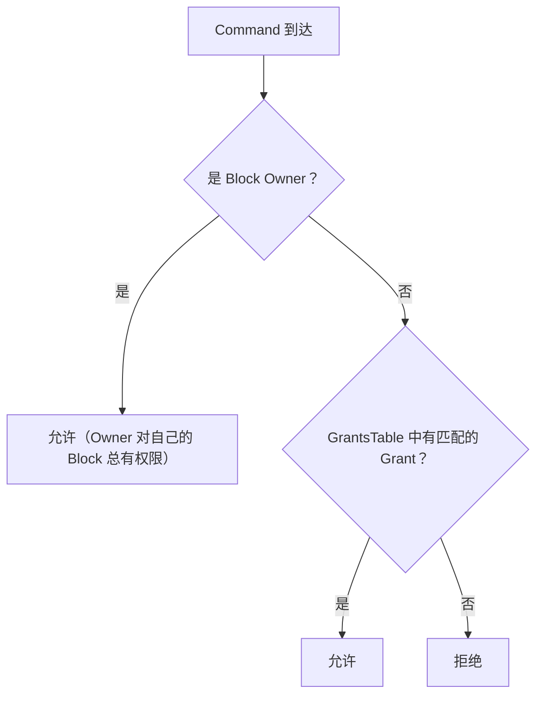
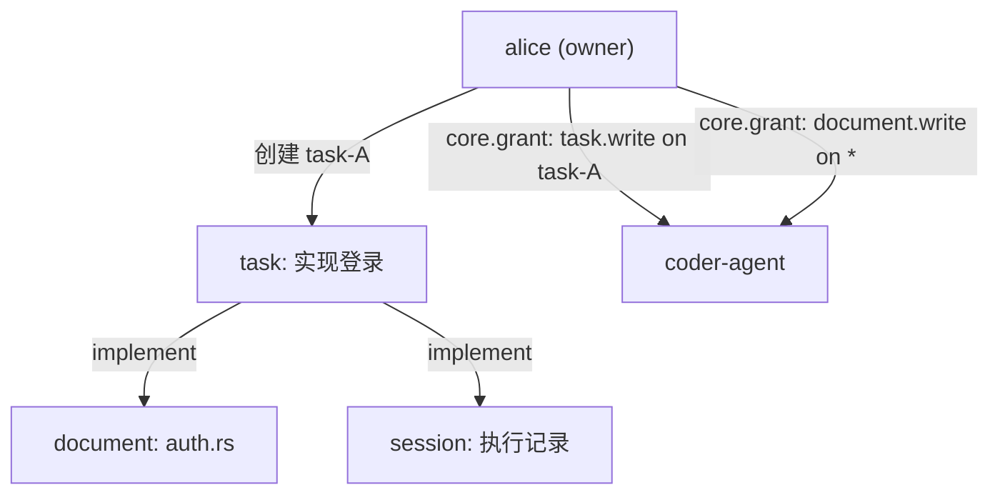

# 能力授权模型 (CBAC)

> Layer 1 — 核心机制，仅依赖 L0（data-model）。
> 本文档定义 Capability-Based Access Control 的授权模型、层级和新架构下的适配。

---

## 一、设计原则

**每个操作都需要授权。** Elfiee 中没有"默认可以做"的操作——每个 Command 在执行前都必须通过 CBAC 检查。这是 Elfiee 作为 EventWeaver 的安全基石。

**产品理念契合：**
- **Source of Truth**：Grant/Revoke 本身也是 Event，权限的历史可审计
- **Agent Building**：Agent 的能力边界由 CBAC 明确定义，不可越权
- **Dogfooding**：权限隔离使得多个 Agent 可以安全地并行工作，互不干扰

---

## 二、授权两层模型

CBAC 按以下优先级判断授权（纯 Event-sourced，无配置文件 bypass）：

### 2.1 两个授权层级

| 层级 | 条件 | 说明 |
|---|---|---|
| **Owner** | editor_id = block.owner | Block 的创建者天然拥有所有权限，不可转让。Owner 不需要任何 Grant |
| **Grant** | GrantsTable 中存在匹配的 (editor_id, cap_id, block_id) 或 (editor_id, cap_id, `"*"`) | 通过 `core.grant` 事件显式授予，通过 `core.revoke` 事件收回 |

**System Editor 的权力来源：** System Editor 不通过配置文件 bypass 鉴权，而是在 bootstrap 时通过直接写入 `core.grant` 通配符事件获得权限。这保证了所有权力都来自 Event（可审计、可回放），符合 Event Sourcing 纯度。

**已删除 Editor 的安全：** `editor.delete` 后，Editor 从 `editors` map 中移除，同时清理其所有 Grant。UUID 不复用天然防止了权限继承攻击，无需维护额外的 `deleted_editors` 集合。

---

## 三、Task 粒度的权限隔离

在新的 Block 分类中，Task Block 是工作分配的枢纽。CBAC 在 Task 层面实现了自然的权限隔离：

**授权模式：**

| 场景 | Grant 方式 | 效果 |
|---|---|---|
| Agent 只能操作自己被分配的 Task | `grant(coder, task.write, task-A)` | coder 只能写 task-A，不能碰其他 task |
| Agent 可以创建和修改 Document | `grant(coder, document.write, "*")` | coder 可以在任何 document 上写入 |
| Agent 只能在特定 Document 上操作 | `grant(coder, document.write, doc-1)` | 更精细的控制 |

**未来方向：** Task 关联的 Block 自动继承权限（"获得 task-A 的 write 权限 → 自动获得 task-A 链接的所有 Block 的 write 权限"）。当前保持显式 Grant，预留此扩展点。

---

## 四、Grant 与 Event 的关系

Grant 和 Revoke 本身通过 Event 记录：

| 操作 | cap_id | Event.entity | Event.value |
|---|---|---|---|
| 授权 | `core.grant` | target_block_id（或 `"*"`） | `{editor, capability, block}` |
| 撤销 | `core.revoke` | target_block_id（或 `"*"`） | `{editor, capability, block}` |

**意义：**
- 权限变更有完整的历史记录（谁在什么时候授予/撤销了什么权限）
- StateProjector 通过 replay grant/revoke 事件重建 GrantsTable
- Agent 可以通过查询 Event 了解权限变更的原因

---

## 五、Agent 模板中的权限矩阵

Agent 工作模板（`.elf/templates/`）中可以声明权限规则，在模板实例化时自动生成 Grant 事件：

| 模板声明 | 含义 |
|---|---|
| `coder → [document.write, session.append]` | coder-agent 获得写文档和记录会话的能力 |
| `reviewer → [document.write(read-only context)]` | reviewer-agent 可以查看文档（通过 document.read） |
| `tester → [session.append]` | tester-agent 只能记录测试结果 |

模板声明是 CBAC 的快捷方式——实际授权仍然通过 `core.grant` 事件完成，保持 Event 作为单一事实来源。

---

## 六、与 AgentChannel 身份体系的映射

三层架构中，AgentChannel 负责 Agent 的注册和路由，Elfiee 负责 CBAC 授权：

| AgentChannel 层 | Elfiee 层 | 映射方式 |
|---|---|---|
| Agent 注册身份（Matrix ID / 3PID） | Editor（bot 类型） | Agent 首次连接 Elfiee 时，创建或关联一个 Editor |
| Agent Router 选择的实例 | 不关心 | Elfiee 只认 editor_id，不关心背后是哪个物理实例 |
| OneAuth 鉴权 | 不参与 | Elfiee 的 CBAC 在 AgentChannel 鉴权之后执行，是第二道关卡 |

**双层鉴权：**
1. AgentChannel：验证"这个请求来自合法的 Agent"
2. Elfiee CBAC：验证"这个 Agent 有权限执行这个操作"

---

## 七、与 Phase 1 的对比

| 方面 | Phase 1 | 重构后 |
|---|---|---|
| 授权检查位置 | Tauri Command 层 + Actor 层 | 统一在 Engine Actor 层（MCP Server 不做授权） |
| Wildcard Grant | 支持 block_id = `"*"` | 保持不变 |
| Task 粒度隔离 | 未实现（所有 Block 平等） | 支持 Task 关联的权限模式 |
| 已删除 Editor 保护 | 后期补丁（deleted_editors 集合） | UUID 不复用 + editor.delete 清理 grants，无需额外集合 |
| 外部身份映射 | 无（Elfiee 是独立应用） | Editor 与 AgentChannel 身份映射 |
| 模板权限声明 | 无 | templates/ 中声明权限矩阵，实例化时自动 Grant |
