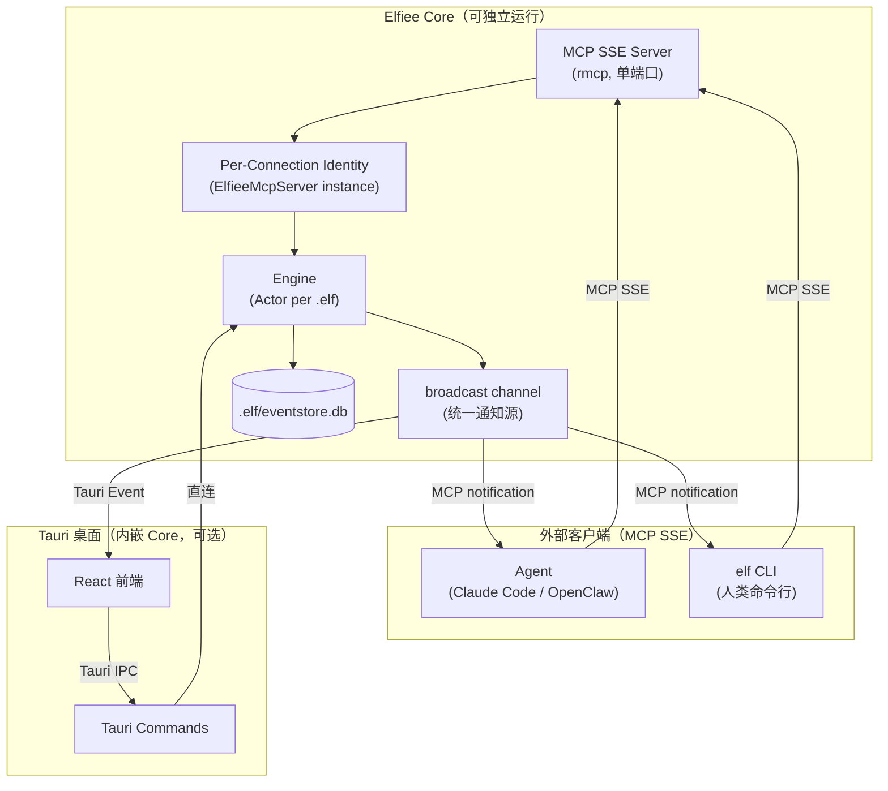
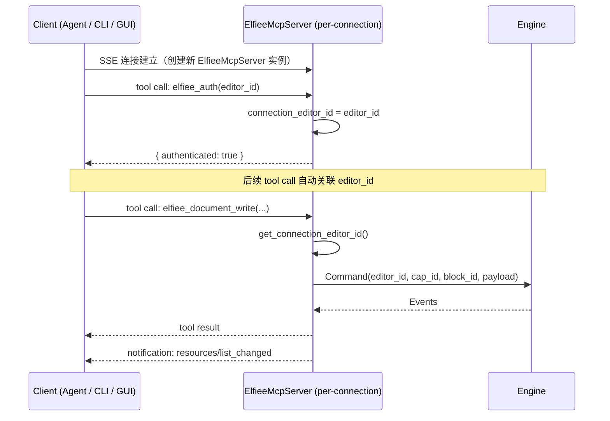
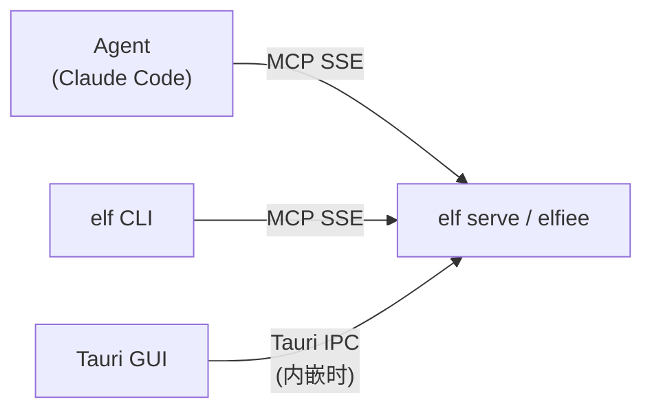
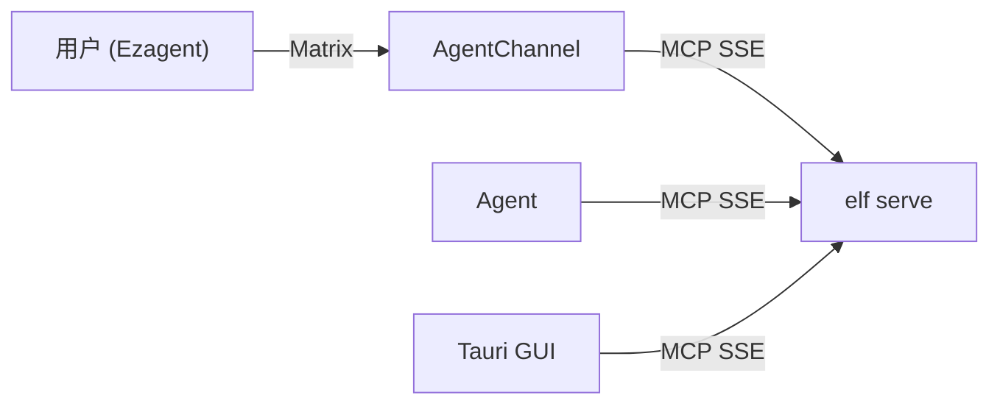

# 统一通讯架构

> Layer 4 — 通讯层，依赖 L3（engine）。
> 本文档定义 Elfiee MCP Server 的通讯架构、连接管理、身份认证和状态通知。

---

## 一、设计原则

**MCP SSE 是标准外部接口。** Elfiee Core（engine + MCP server）是独立的 EventWeaver，不依赖任何特定前端。所有外部客户端（Agent、CLI、远程 GUI）通过 MCP SSE 协议与 Elfiee 通信。不发明自定义协议。

**所有客户端地位平等。** Agent 和人类都是 Editor，通过相同的 Engine 操作。MCP tools 是标准接口。Tauri 桌面版内嵌 Core 时可通过 Tauri IPC 直连引擎（效率优化），但这不影响 Core 的独立性——`elf serve` 可以无 GUI 运行。

**单进程、单端口、多连接。** 一个 `elf serve` 进程托管一个或多个 .elf 项目，通过 MCP SSE 在单端口上接受所有连接。Actor 模型保证串行处理，OCC 处理冲突。

**产品理念契合：**
- **Dogfooding**：Agent、CLI、GUI 使用同一套 MCP tools，切换客户端不需要改 Elfiee
- **Agent Building**：Agent 通过 `elf register` 获得身份，连接 MCP SSE 即可工作
- **Source of Truth**：MCP Server 不做业务逻辑、不做授权检查——它只负责把消息送到 Engine Actor

---

## 二、架构概览



### 2.1 各层职责

| 层 | 职责 | 不做什么 |
|---|---|---|
| **MCP SSE Server** | MCP 协议处理（tool call → 内部调用）、SSE 推送 | 不做授权、不解析业务语义 |
| **Per-Connection Identity** | 跟踪连接的 editor_id、通知扇出 | 不做 CBAC 授权 |
| **Engine Actor** | 命令处理、CBAC 授权、事件持久化 | 不关心消息从哪个连接来 |

---

## 三、传输方式：MCP SSE

### 3.1 为什么只用 SSE

| 传输 | 多连接 | 端口管理 | MCP 支持 | 适用 |
|------|--------|---------|---------|------|
| **SSE** | ✅ 多客户端共享一个 server | 单端口 | ✅ rmcp 原生支持 | **选用** |
| stdio | ❌ 一个 client 一个进程 | 无需端口 | ✅ rmcp 支持 | 不选 |
| WebSocket | ✅ 多客户端 | 单端口 | ❌ rmcp 不支持 | 不选 |

**关键决策：不使用 stdio。** 原因：

1. stdio 是 1:1 模型（一个 client 一个 server 进程），多 Agent 场景需要多个进程，破坏 Actor 串行保证
2. Tauri GUI 作为 MCP client（方案 B）需要连接已运行的 server，stdio 无法做到
3. SSE 解决了 Phase 1 的端口管理问题（所有 Agent 共用一个端口），同时保持多连接能力

### 3.2 SSE 通信模型

```
客户端连接：
  GET  /sse      → 建立 SSE 长连接（server → client 推送）
  POST /message  → 发送 MCP 消息（client → server 请求）

MCP 协议负责消息格式（JSON-RPC 2.0），Elfiee 不定义自定义消息类型。
所有操作通过标准 MCP tool call 完成，状态推送通过 MCP notification 完成。
```

### 3.3 取代 Phase 1 的 MCP SSE 多端口方案

| 方面 | Phase 1 | 重构后 |
|---|---|---|
| 端口分配 | 每个 Agent 一个端口 | **单端口**，所有 client 共用 |
| 连接管理 | EngineManager 管理 N 个 SSE 服务器 | Per-connection ElfieeMcpServer 实例 |
| 身份识别 | 按端口区分 Agent | 按 `elfiee_auth` tool 认证区分 |
| Tauri GUI | 内嵌 Engine（宿主进程） | 两种模式：Tauri IPC（桌面内嵌）或 MCP SSE（远程） |
| 恢复连接 | 需要重新分配端口 | 重连同一端口，重新认证 |

---

## 四、连接级身份认证

### 4.1 认证机制

每个 MCP 连接需要绑定一个 editor_id。通过 `elfiee_auth` MCP tool 完成（MCP 协议无内置认证机制，用 tool call 是最自然的方式）。



### 4.2 editor_id 的来源

| 客户端 | editor_id 来源 | 认证方式 |
|--------|---------------|---------|
| Agent | `elf register` 生成，写入 Agent 的 MCP 配置 | `elfiee_auth(editor_id)` |
| CLI | config.toml 的 `[editor] default` | `elfiee_auth(editor_id)` |
| GUI | config.toml 的 `[editor] default` | `elfiee_auth(editor_id)` |

**认证不等于授权。** `elfiee_auth` 只做身份识别（"这个连接是谁"），不做能力检查。CBAC 授权在 Engine Actor 内部，由 Certificator 执行。

### 4.3 未认证连接的处理

连接后未调用 `elfiee_auth` 的客户端：
- 只能使用不需要身份的 tool（如 `elfiee_file_list`）
- 写操作（create/write/delete/grant 等）被拒绝
- 返回明确的错误提示："请先调用 elfiee_auth 绑定 editor_id"

---

## 五、状态通知

### 5.1 通知机制

Engine 处理 Command 后产生 Events，通过 broadcast channel 统一通知所有端。broadcast channel 是唯一的通知源，不同端通过各自的交付机制接收：

```rust
// 伪代码：Command 处理后的统一通知
fn after_command_success(file_id: &str) {
    // 统一通知源 — 所有端都从这里获取
    state_changed_tx.send(file_id);
}

// MCP 连接端：每个连接独立监听 broadcast，转发为 MCP notification
async fn mcp_notification_task(peer: Peer<RoleServer>, rx: broadcast::Receiver) {
    while let Ok(file_id) = rx.recv().await {
        peer.notify_resource_updated(format!("elfiee://state/{}", file_id)).await;
    }
}

// Tauri 桌面端：监听同一 broadcast，转发为 Tauri Event
async fn tauri_notification_task(app_handle: AppHandle, rx: broadcast::Receiver) {
    while let Ok(file_id) = rx.recv().await {
        StateChangedEvent { file_id }.emit(&app_handle);
    }
}
```

### 5.2 客户端接收通知

| 客户端 | 接收方式 | 响应动作 |
|--------|---------|---------|
| Agent | MCP SSE notification（自动） | 可选择重新查询相关 Block 状态 |
| CLI | MCP SSE notification（自动） | 更新终端显示 |
| GUI（Tauri 桌面） | Tauri Event（内嵌 Core 时） | 重新渲染 UI 组件 |
| GUI（远程） | MCP SSE notification | 重新渲染 UI 组件 |

**通知语义一致：** 无论通过 MCP notification 还是 Tauri Event 接收，通知的内容（file_id）和时机（Command 成功后）完全一致，因为它们来自同一个 broadcast channel。

---

## 六、Per-Connection 身份管理

### 6.1 实现方式

rmcp 为每个 SSE 连接创建独立的 `ElfieeMcpServer` 实例。per-connection 身份直接嵌入服务器实例中（无需独立的 ConnectionRegistry）：

```rust
#[derive(Clone)]
pub struct ElfieeMcpServer {
    app_state: Arc<AppState>,             // 共享的全局状态
    tool_router: ToolRouter<Self>,
    connection_editor_id: Arc<RwLock<Option<String>>>,  // per-connection 身份
}
```

通知扇出由 transport 层处理：每个连接订阅 `state_changed_tx` broadcast，通过 `peer.notify_resource_list_changed()` 推送给客户端。

### 6.2 生命周期

```
1. SSE 连接建立 → 创建新 ElfieeMcpServer 实例（connection_editor_id = None）
2. elfiee_auth   → 设置 connection_editor_id = Some(editor_id)
3. 正常操作      → get_connection_editor_id() 获取已绑定的 editor_id
4. SSE 断开      → 实例自动销毁（Arc drop）
```

---

## 七、多 Agent 并发与冲突处理

### 7.1 Actor 模型保证串行

所有 client 的 Command 进入同一个 Actor 邮箱，串行处理。不同 client 的请求自然排队，无需额外的锁机制。

### 7.2 OCC（乐观并发控制）

当两个 Agent 对同一个 Block 发送 Command 时：

```
Agent A: Command(vector_clock={A:5}) → Actor 处理 → 成功，A:6
Agent B: Command(vector_clock={B:3}) → Actor 处理 → 成功，B:4（不同 Block）
                                                     OR 冲突（同一 Block，counter 不匹配）
```

- **不同 Block**：零冲突（最常见场景，CBAC 天然隔离 Agent 操作范围）
- **同一 Block**：OCC 检测 → 拒绝后到的 Command → client 重新获取状态后重试

### 7.3 与 CRDT 的关系

OCC 是当前策略，足以应对多 Agent 场景。CRDT 是未来扩展（实时协作编辑），engine.md §5.3 已预留扩展点。当前不实现 CRDT。

---

## 八、部署模型

Elfiee Core 支持两种部署方式，共享 100% 的 engine + MCP server 代码。

### 8.1 `elf serve`（headless 模式）

```bash
elf serve [--port 47200] [--project /path/to/project]
```

纯 MCP SSE Server 进程，无 GUI。适用于 CI/CD、远程服务器、多 Agent 协作场景。

```
elf serve (持久进程)
  ├── MCP SSE Server (:47200)
  ├── Per-Connection Identity
  ├── EngineManager
  │   ├── Actor: project-a.elf
  │   └── Actor: project-b.elf
  └── 等待连接...
```

### 8.2 Tauri 桌面应用（内嵌模式）

```bash
elfiee   # 启动桌面应用
```

内嵌 Elfiee Core + 桌面 GUI。MCP SSE Server 同样运行，Agent 可同时连接。

```
elfiee (Tauri 桌面应用)
  ├── Tauri GUI (React 前端)
  ├── Tauri Commands (直连 Engine，specta 类型绑定)
  ├── MCP SSE Server (:47200)  ← 同样运行！
  ├── Per-Connection Identity
  ├── EngineManager
  └── 桌面 + Agent 同时工作
```

### 8.3 共性

两种模式共享：
- Engine（Actor 模型、EventStore、StateProjector、CBAC）
- MCP SSE Server（per-connection identity、elfiee_auth、所有 tools）
- broadcast channel（统一通知源）
- 项目可以动态打开/关闭（通过 `elfiee_open` / `elfiee_close` tool）

差异仅在于：
- `elf serve` 无 GUI，无 Tauri IPC
- Tauri 桌面额外有 Tauri Commands + React 前端（specta 类型绑定）

### 8.4 谁启动 server？

| 场景 | 启动方式 |
|------|---------|
| 人手动使用（headless） | `elf serve` |
| 人桌面使用 | `elfiee`（内嵌 MCP Server） |
| `elf run` 多 Agent 模板 | `elf run` 内部先启动 `elf serve`，再 spawn Agent |
| 开机自启 | 系统服务（未来） |

---

## 九、与 AgentChannel 的对接

### 9.1 当前阶段

Elfiee 作为本地 MCP Server 运行。Agent 通过 MCP SSE 连接，GUI 可内嵌或远程连接：



### 9.2 未来阶段

Elfiee 注册到 AgentChannel 后，远程 Agent 通过 AgentChannel 路由：



**不影响 Elfiee 内部架构：** AgentChannel 对 Elfiee 而言只是另一个 MCP 连接。

---

## 十、与 Phase 1 的对比

| 方面 | Phase 1 | elf serve（headless） | Tauri 桌面（内嵌） |
|---|---|---|---|
| Elfiee 形态 | Tauri 应用（内嵌 Engine） | 独立 MCP Server 进程 | 内嵌 Core + GUI |
| GUI 入口 | Tauri IPC | 无（或远程 MCP SSE） | Tauri IPC（效率优化） |
| Agent 入口 | per-agent MCP 端口 | MCP SSE 单端口 | MCP SSE 单端口（同） |
| 身份识别 | GUI active_editor 共享 | `elfiee_auth` per-connection | Agent: elfiee_auth / GUI: active_editor（UI 状态，非授权） |
| 状态通知 | Tauri Event（仅 GUI） | MCP notification | broadcast → Tauri Event + MCP notification |
| 前端绑定 | specta（Tauri 专用） | 无需（MCP JSON Schema） | specta（保留） |
| 端口管理 | N 个 MCP 端口 | 单端口 | 单端口 |
| 外部对接 | 无 | AgentChannel 可连接 | AgentChannel 可连接 |
