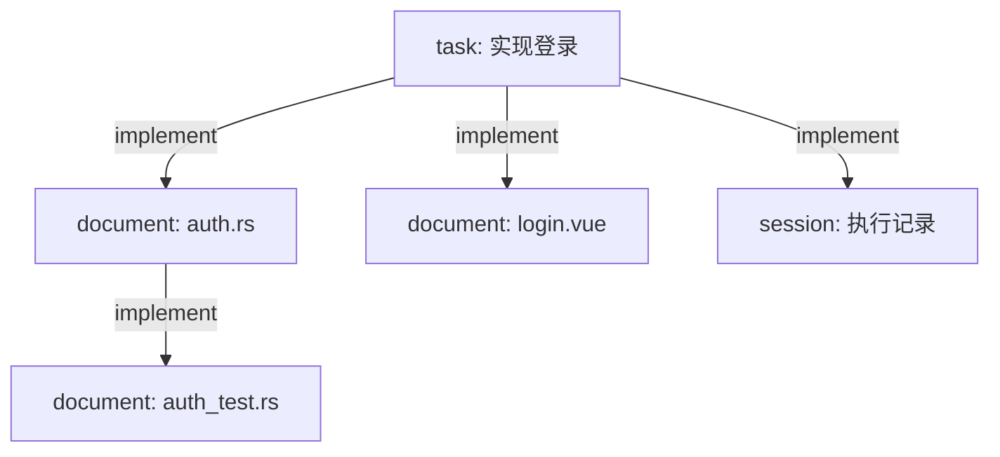
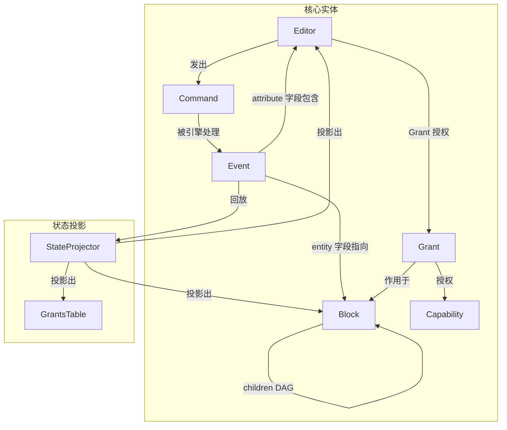

# 核心数据模型

> Layer 0 — 基础定义，无外部依赖。
> 本文档定义 Elfiee 系统中所有核心实体及其关系。

---

## 一、设计原则

**Block 是一切内容的基本单元。** 这是 Elfiee 区别于普通编辑器的根本：通过将所有内容统一为 Block，系统获得了对任意内容施加 link（DAG 关系）、CBAC（权限控制）、Event Sourcing（变更追溯）的能力。

**Event 是事实唯一来源。** 系统不存储"当前状态"，当前状态由 Event 回放计算得出。所有实体（Block、Editor、Grant）的状态都是 Event 的投影。

---

## 二、核心实体

### 2.1 Block

Block 是内容的基本单元。每个 Block 拥有唯一标识、类型、内容和关系图。每种 `block_type` 定义自己的 `contents` schema 和对应的 Capability 集合（通过 Extension 注册）。

**三种 Block 类型：**

| 类型 | 职责 | Event 模式 |
|---|---|---|
| `document` | 文本内容（统一 markdown 和 code） | `full`（创建时）/ `delta`（修改时）/ `ref`（二进制） |
| `task` | 工作单元（目标、状态、分配） | `full` |
| `session` | 执行过程记录（对话、命令、决策标记） | `append`（只追加不修改） |

数据模型中不区分"类别"——`block_type` 是 Block 结构中唯一的类型标识（String 类型，不是枚举），不存在 "category" 字段。三种类型平等地参与 link（DAG 关系）、CBAC（权限控制）和 Event Sourcing（变更追溯）。

**为什么没有 Agent Block？** Agent 的 prompt、provider、model 等配置是 Agent 自身的事务（存储在 Agent 的 settings 中），不属于 Elfiee 的职责。Elfiee 只关心 Editor（身份）——人类和 Agent 在 Elfiee 中是平等的 Editor，通过 `editor.create` 注册、通过 `core.grant` 授权。Agent 的行为配置不需要被 Event-sourced。

**为什么统一 markdown 和 code 为 `document`？**
- 二者本质都是文本文件，差异仅在于 `format` 属性（md / rs / py / toml ...）
- 统一后减少 capability 冗余（`document.write` 替代 `markdown.write` + `code.write`）
- Agent 不需要区分"这是 markdown 还是 code"，只需知道"这是一个文本文件"

**Block 的核心字段：**

| 字段 | 含义 |
|---|---|
| `block_id` | 唯一标识（UUID） |
| `name` | 可读名称（如文件名 `auth.rs`，或任务标题 `实现登录`） |
| `block_type` | 类型标识（String）：`document` / `task` / `session` |
| `contents` | 类型相关的 JSON 内容（详见各类型定义） |
| `children` | DAG 关系图：`{ "implement": ["block-id-1", "block-id-2"] }` |
| `owner` | 创建者的 editor_id（不可变） |
| `description` | 可选描述文本 |

**Block 间的 DAG 关系（children 字段）：**

当前仅支持一种关系类型：`implement`（因果关系）。

语义：`A.children["implement"] = [B]` 表示 "B 是 A 的实现产出"。



DAG 约束：
- **无环**（cycle detection）——`implement` 是因果关系，因果不能循环
- **无自引用**（block 不能 link 到自身）
- 关系类型可扩展（预留，当前只用 `implement`）

**DAG link 与 MyST directive 引用的区别：**

| | children DAG（`core.link`） | MyST directive 引用 |
|---|---|---|
| 存储位置 | `Block.children` 字段 | Document Block 的 `contents.content` 文本中 |
| 语义 | 因果关系（A 导致 B） | 渲染引用（文档中嵌入 B 的内容展示） |
| 环约束 | **禁止环** | **无限制**（渲染时动态拉取，不修改 DAG） |
| 操作方式 | 通过 `core.link` / `core.unlink` Event | 编辑文档文本内容 |

详见 `literate-programming.md`。

### 2.2 Event

Event 是对系统状态变更的不可变记录，采用 EAVT（Entity-Attribute-Value-Timestamp）模型。

| 字段 | 含义 |
|---|---|
| `event_id` | 唯一标识（UUID） |
| `entity` | 被变更的对象（block_id 或 editor_id） |
| `attribute` | 变更的操作者和能力：`"{editor_id}/{cap_id}"`（如 `"coder/document.write"`） |
| `value` | 变更内容（JSON，格式由 `mode` 字段区分，详见 `event-system.md`） |
| `timestamp` | 逻辑时钟（Vector Clock）：`{ "editor_id": transaction_count }` |
| `created_at` | 物理时钟（ISO 8601 UTC） |

**attribute 的格式设计：** 将 editor_id 和 cap_id 编码在同一个字段中，使得单独查询"谁做了什么"和"对某个实体做了什么操作"都可以通过字符串匹配实现，无需额外索引表。

### 2.3 Editor

Editor 代表与系统交互的身份——人类用户或 AI Agent。Editor 本身不持有 Capability；它的操作权限完全由 CBAC 的 Grant 机制管理（详见 `cbac.md`）。

| 字段 | 含义 |
|---|---|
| `editor_id` | 唯一标识（UUID） |
| `name` | 可读名称 |
| `editor_type` | `human`（人类用户）或 `bot`（AI Agent） |

**Editor 在 EAVT 中的两种角色：**

- **作为 Entity**：Editor 自身的生命周期通过 Event 记录——`editor.create`（entity = editor_id）和 `editor.delete`（entity = editor_id）
- **作为 Attribute 的组成部分**：Editor 是所有操作的执行者——Event.attribute = `"{editor_id}/{cap_id}"`，使得"某个 Editor 做了哪些操作"可通过 attribute 前缀查询

**与 AgentChannel 的映射：**
- AgentChannel 中的每个注册 Agent 对应 Elfiee 中的一个 `bot` 类型 Editor
- AgentChannel 的身份标识（3PID / Matrix ID）可存储在 Editor 的 metadata 中
- 人类用户通过 Ezagent（前端）操作时，映射为 `human` 类型 Editor

**Editor 的生命周期事件：**
- `editor.create` → 创建 Editor（entity = 新 editor_id）
- `editor.delete` → 删除 Editor（标记为已删除，不可恢复，防止权限继承攻击）

### 2.4 Command

Command 是 Editor 发出的操作意图。它不直接修改状态，而是被引擎处理后转化为 Event。

| 字段 | 含义 |
|---|---|
| `cmd_id` | 唯一标识（UUID，用于幂等性去重） |
| `editor_id` | 操作者 |
| `cap_id` | 要执行的能力（如 `document.write`、`core.link`） |
| `block_id` | 操作目标（创建类操作为空字符串） |
| `payload` | 能力相关的参数（JSON，由 Capability 定义 schema） |
| `timestamp` | 发出时间 |

**Command 的双路到达方式：** Command 通过两条路径到达引擎，但数据结构统一：
- **Tauri IPC**：桌面 GUI 通过 Tauri Commands 直连引擎（效率优化，保留 specta 类型绑定）
- **MCP SSE**：Agent / CLI / 远程客户端通过 MCP tool call 到达引擎

两条路径共享 100% 的引擎代码（详见 `communication.md` §八 部署模型）。

### 2.5 Grant

Grant 是 CBAC 授权记录，表示"某个 Editor 被授权在某个 Block 上执行某个 Capability"。

| 字段 | 含义 |
|---|---|
| `editor_id` | 被授权者 |
| `cap_id` | 被授权的能力 |
| `block_id` | 作用范围（具体 block_id 或 `"*"` 表示所有 block） |

Grant 通过 `core.grant` 和 `core.revoke` 事件管理（详见 `cbac.md`）。

### 2.6 Capability

Capability 定义了一个可执行的操作单元。它是 Extension 系统的基本构件。

| 字段 | 含义 |
|---|---|
| `cap_id` | 唯一标识（如 `document.write`、`core.link`） |
| `target` | 作用的 block_type 模式（如 `document`、`core/*`） |

每个 Capability 包含两个逻辑：
- **Certificator**：权限检查（调用 CBAC 判断是否授权）
- **Handler**：业务执行（接收 Command + Block，返回 Event 列表）

**Handler 是纯函数**——不产生 I/O 副作用，只接收输入、返回事件。这意味着 Handler 不写文件、不发网络请求、不操作进程。

**Elfiee 不执行工作 I/O。** 写代码文件、跑测试、Git commit 等操作由 Agent 自己在 AgentContext 提供的运行环境中完成。Elfiee 只负责记录 Agent 做了什么（通过 Event）。

**完整的操作序列（以 Agent 写代码为例）：**

```
1. Agent 在 AgentContext 中执行 I/O（写文件、跑命令等）
   — 本地：直接系统调用（fs::write, process::Command）
   — 远程：通过 OneSystem 的 SSH tunnel
2. Agent 向 Elfiee 发送 Command（记录决策事实）
   — document.write: "我写了 auth.rs，内容是..."
   — session.append: "我执行了 cargo test，结果是..."
3. Elfiee Engine 处理 Command:
   a. Certificator → CBAC 授权检查
   b. Handler(Command, Block) → Vec<Event>  ← 纯函数，无 I/O
   c. Event 持久化到 eventstore.db
   d. StateProjector 更新内存状态
4. Elfiee 返回确认给 Agent
```

**关键分工：**

| 职责 | 谁做 | 本地/远程统一方式 |
|---|---|---|
| 文件读写、命令执行、Git 操作 | **Agent**（在 AgentContext 中） | AgentContext 接口抽象（本地 = 系统调用，远程 = SSH） |
| 决策记录（Event 生产和持久化） | **Elfiee** | 始终在 Elfiee 进程内，不涉及本地/远程问题 |
| .elf/ 目录管理（eventstore.db 等） | **Elfiee** | Elfiee 自身的配置 I/O，始终本地 |

Elfiee 只有一类自身 I/O：管理 `.elf/` 目录（读写 eventstore.db、config.toml）。这是 Elfiee 进程本地的操作，不涉及远程。详见 `extension-system.md`。

---

## 三、实体关系图



**关键关系：**
- `Block ↔ Event`：通过 Event.entity 字段关联。一个 Block 的完整历史 = 所有 entity=block_id 的 Event
- `Editor ↔ Event`：通过 Event.attribute 字段关联。一个 Editor 的所有操作 = 所有 attribute 以 editor_id 开头的 Event
- `Block ↔ Block`：通过 Block.children 的 DAG link 关联
- `Editor ↔ Grant ↔ Block`：CBAC 三元组，表示授权关系

---

## 四、与 Phase 1 的对比

| 方面 | Phase 1 | 重构后 |
|---|---|---|
| Block 类型 | 6 种（markdown / code / directory / terminal / task / agent） | 3 种（document / task / session）。block_type 为 String 类型，可自由扩展 |
| 类型区分 | block_type 直接决定能力集 | block_type 决定 contents schema 和 capability 集合，`format` 字段区分文件格式（如 md / rs） |
| 移除的类型 | — | `directory`（文件系统由 AgentContext 管理）、`terminal`（记录用 session 替代）、`agent`（Agent 配置是 Agent 自身事务，不属于 Elfiee） |
| 新增的类型 | — | `session`（从 terminal 演进，只记录不执行） |
| DAG 关系 | 仅 `implement` | 保持 `implement`，预留扩展 |
| Event.value | 无 mode 标记，全量存储 | 新增 `mode` 字段（full / delta / ref） |
| Command 路径 | Tauri IPC 和 MCP tool call 两条路径 | 统一为 MCP SSE tool call（所有客户端平等） |
| Editor 类型 | Human / Bot | 保持不变，增加与 AgentChannel 身份的映射 |

---

## 五、各 Block 类型的 contents 定义

### 5.1 Document Block

| 字段 | 含义 | 示例 |
|---|---|---|
| `format` | 文件格式标识（**创建时必填**，由创建者指定） | `"md"`, `"rs"`, `"py"`, `"toml"`, `"png"`, `"pdf"` |
| `content` | 文本内容（文本格式时） | `"fn main() { ... }"` |
| `path` | 对应的项目文件路径（可选） | `"src/auth.rs"` |
| `hash` | 内容 hash（二进制格式时必填） | `"sha256:a1b2c3..."` |
| `size` | 文件大小（二进制格式时必填） | `102400` |
| `mime` | MIME 类型（二进制格式时可选） | `"image/png"` |

**文本与二进制的区分：** 由创建者在 `core.create` 时通过 `format` 字段显式指定。系统不自动推断。文本格式（md / rs / py / toml 等）使用 `content` 字段存储内容；二进制格式（png / pdf 等）使用 `hash` + `path` 引用外部文件。Event 模式的选择也取决于 `format`：文本格式用 `full` / `delta`，二进制格式用 `ref`。

### 5.2 Task Block

| 字段 | 含义 | 示例 |
|---|---|---|
| `description` | 任务描述 | `"为项目添加 OAuth2 登录"` |
| `status` | 任务状态 | `"pending"` / `"in_progress"` / `"completed"` / `"failed"` |
| `assigned_to` | 被分配的 Agent 或 Editor | `"coder-agent"` |
| `template` | 使用的工作模板（可选） | `"code-review"` |

### 5.3 Session Block

Session Block 统一了两类执行记录：
- Phase 1 的 terminal block（命令执行记录）
- Agent 对话记录（如 `~/.claude/projects/` 中的对话 session）

**Elfiee 只记录，不执行。** 终端进程（PTY）由 AgentContext 的 Bash Session 托管，Elfiee 不再嵌入 PTY。执行结果通过 `session.append` 记录到 Session Block 中。

| 字段 | 含义 | 示例 |
|---|---|---|
| `entries` | 记录条目列表（由 append 事件累积） | `[...]` |

每个 entry 是以下类型之一：

| entry_type | 含义 | 必填字段 |
|---|---|---|
| `command` | 命令执行记录 | `command`, `output`, `exit_code` |
| `message` | 对话消息 | `role`(human/agent/system), `content` |
| `decision` | 决策标记 | `action`, `related_blocks`(可选) |

Session Block 的当前状态 = 所有 `session.append` 事件的有序合并。
