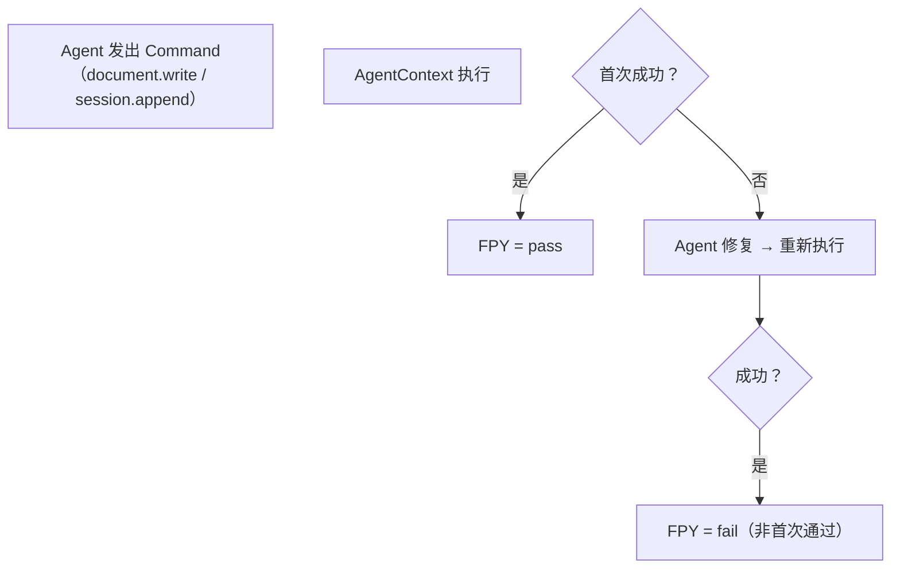
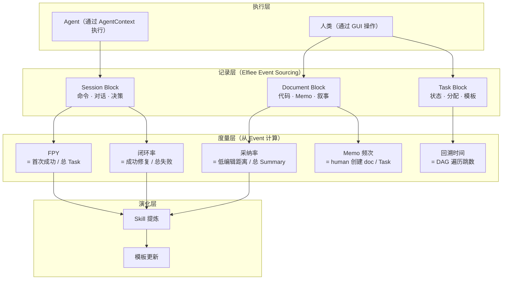

# Dogfooding 原生支持

> Layer 6 — 验证层，依赖全部前序文档。
> 本文档定义 Phase 2 Dogfooding 指标在新架构中的实现路径，以及 Missing Tools 的逐项覆盖。

---

## 一、设计原则

**Dogfooding 不是额外功能，而是架构验证。** Phase 2 的核心验证策略是"用 Elfiee 开发 Elfiee"。新架构必须原生支持所有 Dogfooding 度量指标，而不是在事后补丁式地添加统计功能。

**产品理念契合：**
- **Record**：Dogfooding 过程中的每个操作都是 Event，度量数据从 Event 中直接计算，不需要额外的埋点系统
- **Learn**：Dogfooding 数据（FPY、完成时间、修复闭环率）直接驱动 Skill 演化和模板优化
- **动作即资产**：开发 Elfiee 本身的过程产生的 Session 记录，就是 Skill 提炼的第一批原料

---

## 二、Dogfooding 指标与架构映射

Phase 2 PRD（`product_summarize.md`）定义了五个核心验证指标。以下逐一说明新架构如何原生支持。

### 2.1 Proposal 首次通过率 (FPY) > 60%

**含义：** Agent 读取 Context 后生成的代码/指令，首次执行即可成功的比例。

**架构支撑：**

| 数据来源 | 说明 |
|---|---|
| Session Block（`command` entry） | 记录每次命令执行的 exit_code。exit_code = 0 且是该 Task 的第一次执行 → FPY pass |
| Task Block 状态流转 | `pending` → `in_progress` → `completed` 的 Event 链，标记 Task 生命周期 |
| Event timestamp | 通过 Vector Clock 确定同一 Task 下各 Session entry 的因果顺序 |

**度量计算：** `FPY = count(首次 command exit_code=0 的 Task) / count(所有 completed Task)`

### 2.2 逻辑回溯时间 < 30 秒

**含义：** 面对一段代码，通过 Relation Graph 找到其原始需求所需的时间。

**架构支撑：**

| 数据来源 | 说明 |
|---|---|
| Block DAG | document Block → (反向 implement) → task Block，一跳可达 |
| Snapshot 机制 | 任意时间点的 Block 状态可快速回溯，无需 replay 全部 Event |
| 叙事文档 | 如果存在叙事文档（`literate-programming.md`），直接提供整理过的上下文 |

**关键：** DAG 的 `implement` 关系是回溯的核心路径。确保所有 Agent 产出的 document Block 都通过 `core.link` 关联到 Task Block。

### 2.3 Session 修复闭环率 > 90%

**含义：** 测试报错时，Agent 通过 Session 记录上下文、修复并验证通过的比例。

**架构支撑：**

| 组件 | 角色 |
|---|---|
| Session Block | 记录报错的命令和输出 |
| AgentContext | 提供 Bash Session 执行修复命令 |
| Agent（外部） | 读取错误上下文（通过 MCP 查询 Session），生成修复方案 |
| Session Block | 记录修复过程和最终结果 |

**流程：**
1. Session 记录测试失败（`command` entry，exit_code ≠ 0）
2. Agent 读取失败上下文 → 生成修复代码 → 通过 AgentContext 执行
3. Session 记录修复结果
4. 如果最终 exit_code = 0 → 闭环成功

**度量计算：** `闭环率 = count(最终在 Session 中记录成功的修复) / count(所有测试失败记录)`

### 2.4 Summary 采纳率 > 80%

**含义：** AI 自动生成的决策总结，用户仅需"一键确认"或修改字数少于 20%。

**架构支撑：**

| 数据来源 | 说明 |
|---|---|
| Session Block（`decision` entry） | 记录 Agent 生成的 Summary（action = "summary"） |
| Document Block（叙事文档） | Agent 生成的叙事草稿，人类 Review 后的最终版本 |
| Event delta | 人类对 Agent 生成内容的修改量，通过 `document.write` 的 delta 模式量化 |

**度量计算：** 比较 Agent 生成的 Summary 和人类最终确认的版本之间的编辑距离。编辑距离 < 20% 原文长度 → 采纳。

### 2.5 Memo 使用频次 > 3 条/功能

**含义：** 开发过程中，用户自发创建的非结构化记录数量。

**架构支撑：**

| 数据来源 | 说明 |
|---|---|
| Document Block | 用户创建的 Memo 就是 Document Block（format: md），通过 `core.link` 关联到 Task |
| Event 统计 | 统计每个 Task 关联的 Document Block 中，由 human Editor 创建的数量 |

**关键：** Memo 不需要额外的 Block 类型。Document Block + link to Task 即可满足。低摩擦是关键——创建 Memo 应该和"随手写个笔记"一样简单。

---

## 三、Missing Tools 覆盖清单

Phase 2 PRD（`Missing tools and Manual Substitutes.md`）中标记了缺失的能力。以下说明新架构如何逐项覆盖。

### 3.1 最高优先级（FPY + task.commit）

| 缺失工具 | 新架构的覆盖方式 |
|---|---|
| **test_result / FPY** | Session Block 的 `command` entry 自动记录 exit_code。Agent 通过 AgentContext 执行测试，结果自动流入 Session。FPY 从 Session Event 链中计算 |
| **task.commit** | Task Block 状态变为 `completed` 时生成 Checkpoint 快照。Git 操作（branch/add/commit）委托给 AgentContext，commit hash 作为 `decision` entry 记录在 Session 中 |

### 3.2 其他缺失工具

| 缺失工具 | 新架构的覆盖方式 |
|---|---|
| **Task Type（任务分组）** | Task Block 的 `template` 字段标识使用的工作模板。同一模板下的 Task 天然属于同一类型 |
| **implement 关系细分** | 当前保持 `implement` 单一关系类型。DAG 关系类型预留扩展（`data-model.md`），未来可添加 `test`、`reference` 等关系 |
| **Clarification** | Session Block 的 `message` entry 记录对话过程。Agent 或 PM 可以在事后回放 Session，标注 clarification 轮次（通过 `decision` entry） |
| **Task 状态机** | Task Block 的 status 字段覆盖 `pending` / `in_progress` / `completed` / `failed`。每次变更都是 Event，完整记录状态流转时间线 |
| **PM 验收测试** | 人类 Editor 对 Task 执行 `task.write`（status = completed / failed），本身就是验收记录。通过 Event.attribute 可追溯"谁做了验收" |
| **Archive** | Task Block 状态为 `completed` 后可被标记为归档。Checkpoint 快照提供冻结的状态视图。叙事文档提供可读的归档报告 |
| **History Reference** | Agent 的 Session 中如果引用了历史 Task/Skill（通过 `decision` entry 的 related_blocks），即构成可追踪的"学习行为" |
| **Summary** | Agent 通过遍历 Task DAG 自动生成叙事文档（`literate-programming.md`）。人类 Review 后的采纳率可量化 |

---

## 四、Dogfooding 数据流

**关键设计：** 所有度量数据都从 Event 链中直接计算。不需要额外的埋点、日志收集或统计系统。Event Sourcing 本身就是完整的审计日志。

---

## 五、Dogfooding 实施路径

### 5.1 最小可行 Dogfooding

使用新架构开发 Elfiee 自身的一个真实功能：

| 步骤 | 操作 | 产出 |
|---|---|---|
| 1. 创建 Task | 人类创建 Task Block，描述功能需求 | Task Block + Memo Documents |
| 2. 分配 Agent | 通过模板实例化，创建 Editor 和 Session | Editor（bot） + Session Block + Grant Events |
| 3. Agent 执行 | Agent 读取 Task 上下文，通过 AgentContext 编写代码 | Document Blocks（代码） + Session entries（过程） |
| 4. 人类 Review | 人类审查代码，通过/拒绝 | Session entries（decision） |
| 5. 测试验证 | Agent 通过 AgentContext 运行测试 | Session entries（command + exit_code） |
| 6. 完成 Task | Task 状态变为 completed，触发 Checkpoint | Snapshot + 可计算的度量数据 |

### 5.2 验证标准

| 标准 | 来源 | 验证方式 |
|---|---|---|
| 资产完整性 | `product_summarize.md` §8 | Task 关联的所有 Block 都有完整的 Event 链，Relation 覆盖率 100% |
| FPY > 60% | `product_summarize.md` §8 | 从 Session 的 command entry 计算 |
| 回溯时间 < 30s | `product_summarize.md` §8 | DAG 遍历 + Snapshot 支持 |
| 闭环率 > 90% | `product_summarize.md` §8 | 从 Session 的修复记录计算 |
| 采纳率 > 80% | `product_summarize.md` §8 | 从 Document 的 delta Event 计算 |
| Memo > 3条/功能 | `product_summarize.md` §8 | 从 human Editor 创建的 Document Block 统计 |

---

## 六、与 Phase 1 的对比

| 方面 | Phase 1 | 重构后 |
|---|---|---|
| Dogfooding 支持 | 手动记录，PM 人工判断指标 | Event 链原生支持所有度量指标的自动计算 |
| FPY 度量 | 无（Dev 口头说明、PM 人工判定） | Session Block 自动记录 exit_code，FPY 可从 Event 直接计算 |
| task.commit | 在 Elfiee 内执行 Git 操作 | Task 状态管理 + Git 委托给 AgentContext + commit hash 记录在 Session |
| Summary 生成 | 无 | Agent 遍历 DAG 自动生成叙事文档，人类 Review |
| Memo | 无专门支持 | Document Block + link to Task |
| 回溯能力 | 只能回放到最新状态 | Snapshot + DAG 支持任意时间点回溯 |
| 度量数据源 | PM 手动收集 | 全部从 Event 链自动计算 |
