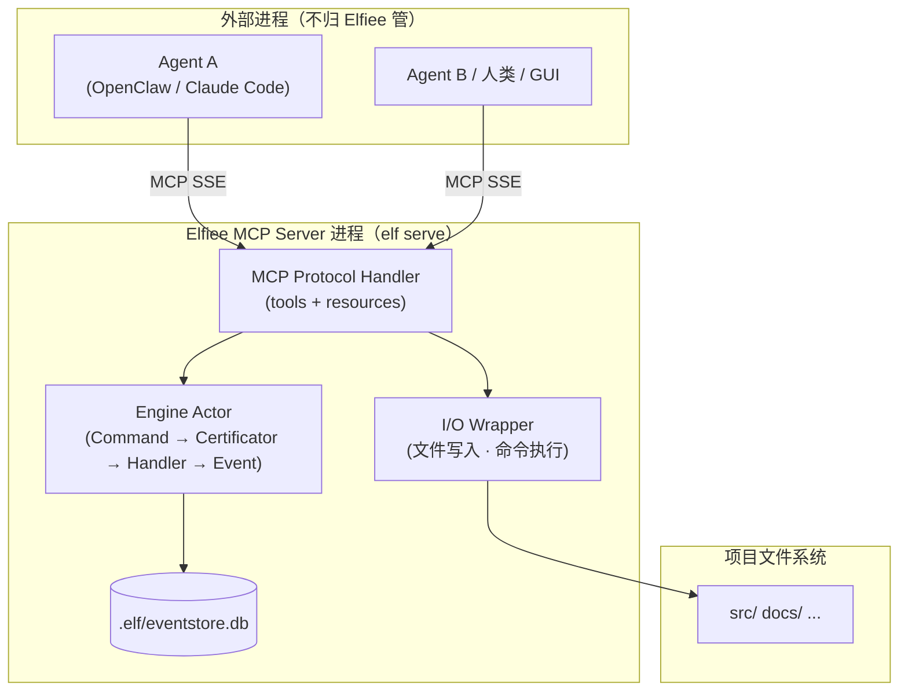
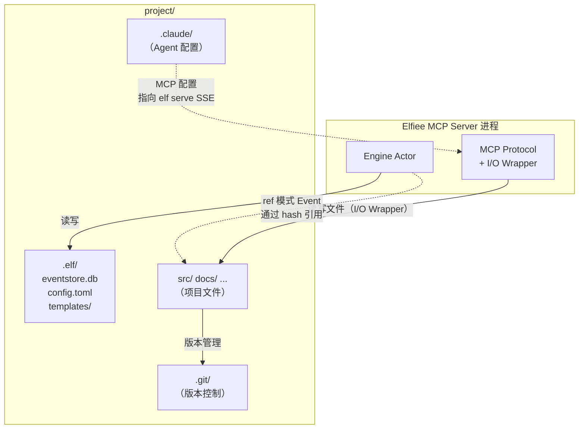
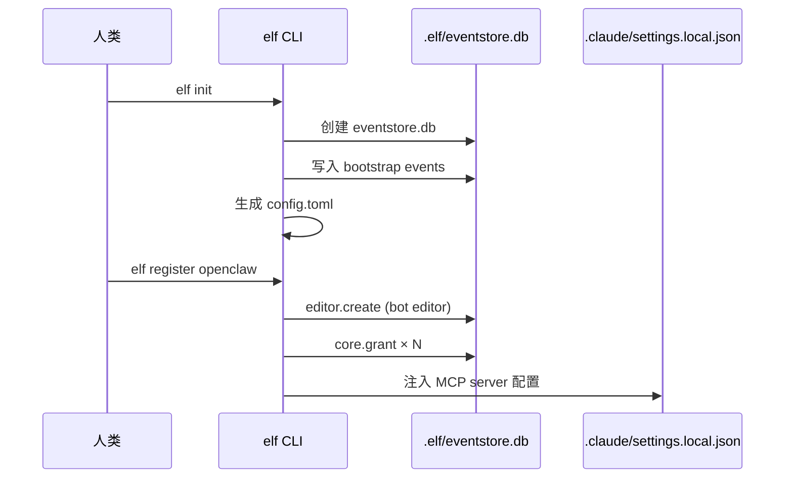
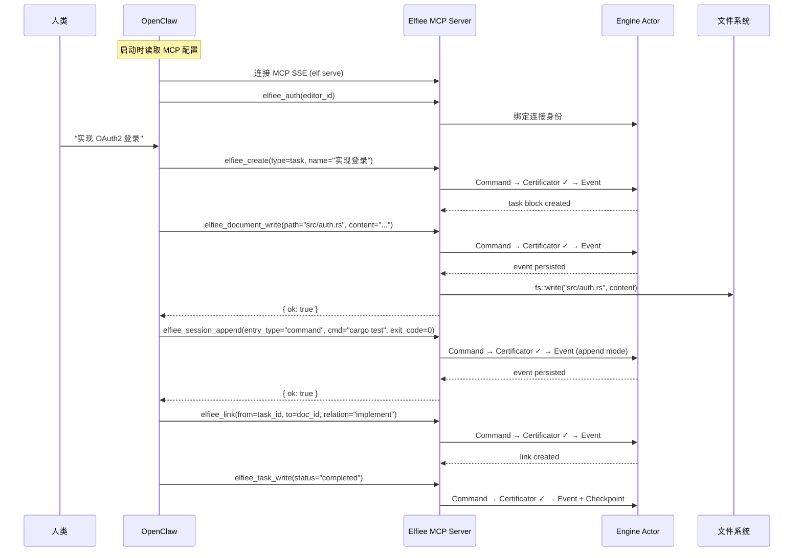
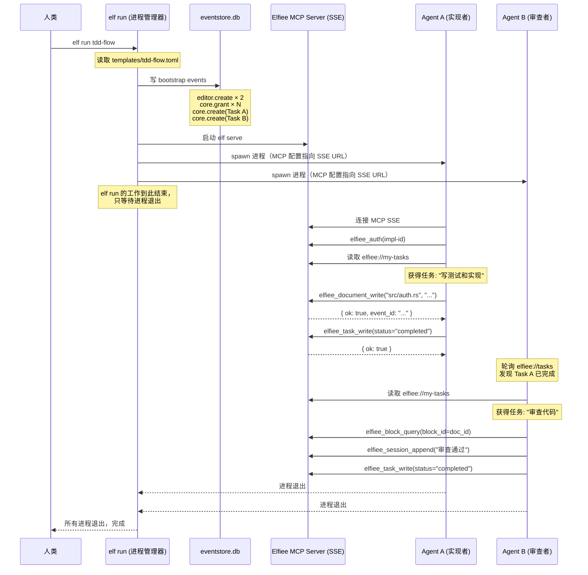

# .elf 项目格式与 MCP Server

> Layer 2 — 项目格式，依赖 L1（event-system）。
> 本文档定义 Elfiee 的项目形态、目录结构、CLI 命令、MCP Server 入口、Agent 注册机制和用户旅程。

---

## 一、设计原则

**Elfiee 是嵌入项目目录的 EventWeaver（事件织机）。**

它不是桌面应用（Phase 1），不是被动记录器（entireio/cli），不是 Agent 本身（pi-mono），也不是编排器。它是纯被动的 MCP Server——收到 tool call 就鉴权、写 Event、返回状态，仅此而已。通过 `.elf/` 目录持久化 Event 日志和项目配置。

**类比 EZAgent Socialware：**
- Elfiee = EventWeaver（事件溯源层）
- 模板 = Socialware 声明（角色、流程、权限的声明式定义）
- 编排 = 外部 Coordinator（人类或 Agent）通过 MCP tools 协调

**通信方向始终是单向的：Agent → Elfiee。** Elfiee 不 spawn Agent，不发指令，不监控进程。谁调用 MCP tool，Elfiee 就为谁服务。

**类比：**

| 工具 | 形态 | 启动方式 | 持久化 |
|------|------|---------|--------|
| Git | 嵌入项目的 CLI | 用户主动调用 | `.git/` |
| rust-analyzer | 嵌入项目的 LSP Server | 编辑器自动启动 | 无 |
| **Elfiee** | 嵌入项目的 MCP Server | `elf serve` 启动，Agent 连接 SSE | `.elf/` |
| EZAgent EventWeaver | 事件溯源中间件 | Room 创建时启动 | Timeline DB |

**为什么必须是主动模式（MCP）而非被动记录：**

| Elfiee 四支柱 | 主动（MCP）| 被动（Hook/Transcript Import）|
|---|---|---|
| Event Sourcing | ✅ 实时记录每个操作 | ✅ 批量导入 |
| CBAC | ✅ Certificator 实时鉴权，可阻止越权 | ❌ 事后记录，无法阻止 |
| Block DAG | ✅ Agent 通过 tool 创建 link | ❌ Transcript 中无 DAG 信息 |
| Agent Template | ✅ 模板声明角色/权限/流程，Coordinator 按需执行 | ❌ Agent 独立工作，无规则 |

被动模式丢失 3/4 支柱，退化为 entireio/cli（已有解决方案）。Elfiee 的差异化价值在于**实时的 CBAC 鉴权和声明式的协作规则**，这要求主动 MCP 模式。

**产品理念契合：**
- **Record**：MCP tool call → Command → Event → persist，每个操作实时记录
- **Agent Building**：模板声明角色和流程规则，Coordinator（人或 Agent）通过 MCP tools 执行
- **Source of Truth**：eventstore.db 是所有决策记录的唯一事实来源
- **Dogfooding**：.elf/ 可以被 Git 追踪，开发 Elfiee 本身的决策记录也是项目的一部分

---

## 二、目录结构

```
project/                        # 项目根目录
├── .elf/                       # Elfiee 元数据目录
│   ├── eventstore.db           # Event 日志（SQLite，events + snapshots 表）
│   ├── config.toml             # 项目配置
│   └── templates/              # Agent 工作模板（详见 agent-building.md）
│       ├── code-review.md
│       └── tdd-flow.md
├── src/                        # 项目源码（不归 Elfiee 管）
├── .claude/                    # Claude Code/OpenClaw 配置（Agent 自有）
│   └── settings.local.json     # ← elf register 注入 MCP 配置到此处
├── .git/                       # Git 版本控制（不归 Elfiee 管）
└── ...
```

### 2.1 eventstore.db

SQLite 数据库，包含两张表：

| 表 | 定位 | 内容 |
|---|---|---|
| `events` | 事实来源（只追加） | 所有 EAVT 事件记录（详见 `event-system.md`） |
| `snapshots` | 派生数据（可重建） | 特定 Block 在特定 Event 后的完整状态 |

### 2.2 config.toml

```toml
[project]
name = "my-project"             # 项目显示名称

[editor]
default = "system-editor-uuid"  # 本机默认 editor_id
name = "yaosh"                  # 本机 editor 可读名称

[extensions]
enabled = ["document", "task", "session"]
```

**config.toml 只存静态项目配置。** 以下信息不在 config.toml 中：

| 不存的信息 | 原因 | 实际存储位置 |
|---|---|---|
| Editor 列表（含 Agent） | 动态状态，应从 Event 投影 | eventstore.db（editor.create Events） |
| 权限配置 | Event-sourced | eventstore.db（Grant Events） |
| 模板列表 | 文件系统即列表 | templates/ 目录扫描 |
| Agent 连接信息 | 注入到 Agent 自己的配置目录 | `.claude/settings.local.json` 等 |
| Agent 行为定义（prompt/model） | Agent 自己的事，不归 Elfiee 管 | Agent 的配置目录 |

**人类和 Agent 是平等的 Editor。** `elf register` 在 eventstore.db 中创建 Editor（Event-sourced），同时向外注入 MCP 配置（含 SSE URL 和 editor_id）。Elfiee 不关心 Agent 的 prompt、model、provider——那是 Agent 自己的事。config.toml 不存储任何 Agent/Editor 动态信息。

### 2.3 templates/

Agent 工作模板，定义多 Agent 协作的规则（详见 `agent-building.md`）。模板文件是 Markdown/TOML，人类可读。

---

## 三、不存储什么

| 内容 | Phase 1 | 重构后 | 理由 |
|---|---|---|---|
| 文本文件内容 | 是（Event.value 全量 + block 目录） | Event 中存（full/delta） | Event 是事实来源 |
| 二进制文件内容 | 是（block 目录） | 不存（Event 只存 ref） | 文件在项目文件系统中，Git 做版本管理 |
| 文件系统目录结构 | 是（directory block） | 不存 | 文件系统由 AgentContext 管理 |
| Block 渲染快照 | 是（_snapshot 文件） | 不存 | 快照在本机缓存 `~/.elf/cache/` |
| Block 资源目录 | 是（block-{uuid}/） | 不存 | 无需独立的 per-block 目录 |
| Agent 连接配置 | 否 | 不存 | 注入到 Agent 自己的配置目录 |

---

## 四、elf CLI

`elf` 是 Elfiee 的命令行入口，提供项目初始化、Agent 注册和 MCP Server 启动。

### 4.1 命令总览

| 命令 | 用途 | 何时使用 |
|---|---|---|
| `elf init` | 创建 `.elf/` 目录 | 项目首次接入 Elfiee |
| `elf register <agent-type>` | 注册 Agent（创建 Editor + Grants）并注入 MCP 配置 | 给项目接入一个 Agent |
| `elf serve` | 启动 MCP SSE Server 持久进程 | 用户手动启动，所有客户端连接此端口 |
| `elf run <template>` | 便利脚本：读模板 → 创建角色 → 启动 `elf serve` → spawn Agent 进程 | 按模板快速启动多 Agent 工作 |
| `elf status` | 查看项目状态 | 检查已注册 Editor、Block 统计 |

### 4.2 elf init

```bash
elf init
```

执行流程：

```
1. 创建 .elf/ 目录
2. 创建 eventstore.db（events + snapshots 表）
3. 写入 bootstrap events：
   ├── editor.create（system editor）
   └── core.grant × N（system editor wildcard grants）
4. 生成 config.toml：
   ├── [project] name = 目录名
   ├── [editor] default = system editor id
   └── [extensions] enabled = [...]
5. 创建 templates/（空目录）
```

bootstrap events 通过直接写入 EventStore 完成（不走 Command 管道），解决鸡生蛋问题——system editor 需要 grants 才能发 Command，但 grants 本身需要 Event 创建。（详见 `cbac.md` 的 certificator 设计。）

### 4.3 elf register

```bash
elf register <agent-type> [--config-dir <path>]
```

支持的 agent-type：

| agent-type | 配置注入目标 | 说明 |
|---|---|---|
| `claude-code` | `.claude/settings.local.json` | Claude Code |
| `openclaw` | `.claude/settings.local.json` | OpenClaw（同 Claude Code 格式） |
| `cursor` | `.cursor/mcp.json` | Cursor |
| `windsurf` | MCP 配置文件 | Windsurf |

执行流程：

```
1. 在 eventstore.db 中写入 bootstrap events：
   ├── editor.create（bot editor for this agent）
   └── core.grant × N（基础权限）

2. 注入 MCP 配置到 Agent 的配置目录（详见 §七）
```

注意：不创建 Agent Block。Agent 的 prompt、model、provider 等配置是 Agent 自己的事，不归 Elfiee 管理。Elfiee 只关心 Editor 身份和权限。

### 4.4 elf serve

```bash
elf serve [--port 47200] [--project /path/to/project]
```

启动 MCP SSE Server 持久进程。**单端口、单进程、多连接**——所有客户端（Agent、CLI、GUI）通过 MCP SSE 连接到同一端口。

**为什么只用 SSE，不用 stdio？**

| 传输 | 多连接 | 端口管理 | 适用 |
|------|--------|---------|------|
| **SSE** | 多客户端共享一个 server | 单端口 | **选用** |
| stdio | 一个 client 一个进程 | 无需端口 | **不选**（破坏 Actor 串行保证） |

stdio 是 1:1 模型——每个 Agent spawn 一个独立的 MCP Server 进程。多 Agent 场景下，不同进程各自持有独立的 StateProjector，无法保证 Actor 的串行一致性。SSE 在单进程中接受所有连接，Actor 邮箱自然排队，彻底解决 Phase 1 的端口分配问题。

**Elfiee 仍然是被动的**——它不 spawn Agent，不发指令，只响应 tool call。

### 4.5 elf run（便利脚本）

```bash
elf run <template> [--agent-type <type>]
```

`elf run` 是 CLI 便利脚本（类似 `docker-compose up`），**不是 Elfiee MCP Server 的功能**。它读取模板、创建角色、启动进程——所有这些都可以人工手动完成。

执行流程：

```
1. 读取 .elf/templates/<template>.toml，解析角色和流程
2. 写入 bootstrap events 到 eventstore.db：
   ├── editor.create × N（每个角色一个 Editor）
   ├── core.grant × N（按模板定义的权限）
   └── core.create × N（Task Block，分配给对应 Editor）
3. 启动 elf serve（MCP SSE Server）
4. 为每个 Agent 注入 MCP SSE 配置（含 SSE URL + editor_id）
5. Spawn Agent 进程
6. 等待所有进程退出 → 结束
```

**关键：`elf run` 写完 bootstrap events 后就只做进程管理。** 它不监控 Task 状态、不协调流程推进、不做任何编排逻辑。流程推进由参与者自己完成——Agent 查询 `elfiee://my-tasks`，按 Task 状态自主决定下一步。

等价的手动操作：

```bash
# 手动做 elf run 做的事（完全等价）
elf serve &                              # 1. 启动 MCP SSE Server
# 通过任何 MCP client 创建角色和任务：
#   elfiee_auth(editor_id)               # 认证连接身份
#   editor.create("implementer")
#   editor.create("reviewer")
#   core.grant(implementer, "document.write", "*")
#   core.create(Task: "写测试", assigned_to=implementer)
# Agent 启动后连接 SSE、调用 elfiee_auth 认证身份
openclaw &                               # 2. 启动 Agent（MCP 配置指向 SSE URL）
openclaw &                               # 3. 启动 Agent
wait                                      # 4. 等待完成
```

人类也可以是 Coordinator——手动创建 Editor、分配 Task、按需 spawn Agent。`elf run` 只是把这些步骤自动化了。

---

## 五、MCP Server — 核心入口

### 5.1 架构定位



**Elfiee 只有三层，没有 Orchestrator：**

| 层 | 职责 | 纯度 |
|---|---|---|
| MCP Protocol Handler | JSON-RPC 消息解析、tool/resource 路由 | 无状态 |
| Engine Actor | Command 处理、CBAC 鉴权、Event 持久化 | **Handler 是纯函数** |
| I/O Wrapper | 文件写入、命令执行 | 有副作用，在 Handler 之外 |

编排逻辑不在 Elfiee 内。谁想当 Coordinator（人类、某个 Agent、`elf run` 脚本），谁就通过 MCP tools 创建 Task、分配权限、推进流程。Elfiee 只管鉴权和记 Event。

### 5.2 MCP Tools

Elfiee MCP Server 暴露的 tools，按操作类型分两类：

**写入类（产生 Event）：**

| tool | 对应 Capability | 说明 |
|---|---|---|
| `elfiee_create` | `core.create` | 创建 Block（document/task/session） |
| `elfiee_link` | `core.link` | 建立 DAG 关系 |
| `elfiee_unlink` | `core.unlink` | 解除 DAG 关系 |
| `elfiee_delete` | `core.delete` | 删除 Block |
| `elfiee_grant` | `core.grant` | 授予权限 |
| `elfiee_revoke` | `core.revoke` | 撤销权限 |
| `elfiee_document_write` | `document.write` | 记录文件变更 + 写文件到磁盘 |
| `elfiee_session_append` | `session.append` | 追加执行记录条目 |
| `elfiee_task_write` | `task.write` | 更新 Task 状态 |

**查询类（不产生 Event）：**

| tool | 说明 |
|---|---|
| `elfiee_block_query` | 查询 Block 状态（含 DAG 关系） |
| `elfiee_task_list` | 列出 Task 及其状态 |
| `elfiee_block_search` | 按 block_type/name 搜索 Block |

所有写入类 tool 都经过 CBAC 鉴权。查询类 tool 目前不鉴权（未来可按需添加 `core.read` 权限）。

### 5.3 MCP Resources

| resource URI | 说明 |
|---|---|
| `elfiee://blocks` | 所有 Block 列表 |
| `elfiee://block/{id}` | 特定 Block 的当前状态 |
| `elfiee://tasks` | 当前 Task 列表及状态 |
| `elfiee://grants` | 当前权限表 |
| `elfiee://editors` | 当前 Editor 列表 |
| `elfiee://my-tasks` | 当前连接 Editor 被分配的 Task（基于 editor_id 过滤） |
| `elfiee://my-grants` | 当前连接 Editor 的权限列表 |
| `elfiee://events` | Event 历史（支持分页和时间范围过滤） |

注意：templates 不是 MCP resource——模板是静态文件，由 `elf run` 或人工读取，不经过 MCP Server。

### 5.4 通信模型：单向被动

**通信方向始终是 Agent → Elfiee，没有反向。**

```
Agent/人类/GUI  ──── MCP tool call ────→  Elfiee MCP Server
                                              │
                                              ├── Certificator（鉴权）
                                              ├── Handler（纯函数 → Event）
                                              ├── Persist（写 eventstore.db）
                                              └── I/O Wrapper（文件操作）
                ←── MCP response ────────     │
```

Elfiee **不做**的事：
- 不 spawn Agent 进程
- 不发指令给 Agent
- 不监控 Task 状态推进流程
- 不解析模板
- 不管理 Agent 生命周期

**多 Agent 协作通过共享状态实现，不需要 Elfiee 编排：**

| 问题 | 方案 | 说明 |
|---|---|---|
| Agent 如何知道自己的任务？ | 查询 `elfiee://my-tasks` | 基于 editor_id 过滤 |
| 多 Agent 间如何协调？ | 共享 Task Block 状态 | Agent A 完成 Task → Agent B 查询发现可以开始 |
| 谁推进流程？ | Coordinator（人或 Agent） | 通过 MCP tools 创建/更新 Task，不是 Elfiee |
| 谁 spawn Agent？ | `elf run` 脚本 或 人手动 | 进程管理不是 MCP Server 的职责 |

这是 Socialware 的哲学——**规则是声明式的（模板），执行是自治的（Agent 自主查询和行动），Elfiee 只管记账和鉴权。**

---

## 六、MCP Tool = Event + I/O（替代，非叠加）

### 6.1 核心原则

**MCP tool call 替代 Agent 的原生操作，而不是在原生操作之上叠加。**

```
❌ 叠加（double-token）：
  Agent → 原生 Write tool: 写文件         [tokens]
  Agent → Elfiee MCP: document_write      [tokens]  ← 重复

✅ 替代（single-token）：
  Agent → Elfiee MCP: document_write(path, content)
    Elfiee 内部:
      1. Certificator 鉴权              ← CBAC 生效
      2. Handler 生成 Event（纯函数）    ← Event Sourcing
      3. Persist Event to eventstore.db
      4. I/O Wrapper: 写文件到磁盘       ← 实际执行
  Agent 收到: { ok: true, event_id: "..." }
```

### 6.2 Handler 纯度不受影响

Handler 返回 Events，不做 I/O。I/O 在 MCP tool 的 wrapper 层完成：

```
MCP tool "elfiee_document_write" 的处理链：

  ┌─────────────────────────────────────────────┐
  │  Engine Actor（纯）                          │
  │  Command → Certificator → Handler → Events  │
  │  → persist Events → apply to StateProjector │
  └──────────────────┬──────────────────────────┘
                     │ 返回 Events
  ┌──────────────────▼──────────────────────────┐
  │  MCP I/O Wrapper（有副作用）                  │
  │  根据 Event 内容执行文件写入                   │
  │  fs::write(path, content)                    │
  └──────────────────┬──────────────────────────┘
                     │
  ┌──────────────────▼──────────────────────────┐
  │  MCP Response                                │
  │  { ok: true, event_id: "..." }              │
  └─────────────────────────────────────────────┘
```

### 6.3 不同 Agent 的集成成本

| Agent | 集成方式 | Token 额外成本 | CBAC 生效 |
|---|---|---|---|
| OpenClaw（开源） | 改造源码：替换原生 Write 为 Elfiee MCP tool | **零**（替代） | ✅ |
| Claude Code（闭源） | MCP tools + system prompt 引导优先使用 | ~25%（prompt 引导不完美时有叠加） | ✅ |
| Cursor / Windsurf | MCP tools + prompt 引导 | ~25% | ✅ |
| 无 MCP 支持的 Agent | 不支持（Elfiee 必须走 MCP） | — | — |

**OpenClaw 是最佳适配目标**——开源可改造，MCP 原生支持，且缺少审计/权限/恢复能力（正是 Elfiee 提供的）。

---

## 七、Agent 注册与 MCP 注入

### 7.1 注册原理

`elf register` 做两件事：
1. **向内**：在 eventstore.db 中创建 Agent 的身份（Editor + Grants，不创建 Agent Block）
2. **向外**：注入 MCP Server 配置到 Agent 的配置目录

**Agent 连接配置不在 `.elf/` 中，而是注入到 Agent 自己的配置目录。** 这是因为 Agent 需要在连接 Elfiee 之前就知道如何找到 Elfiee——鸡生蛋问题。

**为什么不创建 Agent Block？** Agent 的 prompt、model、provider 等配置是 Agent 自己的内部实现细节，不归 Elfiee 管。Elfiee 只关心 Editor 身份（who）和权限（can do what），不关心 Agent 的能力实现（how）。这与 Socialware 的 Identity 平等原则一致——人类和 Agent 共享相同的身份模型。

### 7.2 MCP 配置注入示例

`elf register openclaw` 向 `.claude/settings.local.json` 注入：

```json
{
  "mcpServers": {
    "elfiee": {
      "type": "sse",
      "url": "http://localhost:47200/sse",
      "env": {
        "ELFIEE_EDITOR_ID": "editor-uuid-for-openclaw"
      }
    }
  }
}
```

`env` 字段在 SSE 模式下不是给 spawn 进程用的（SSE 不 spawn 进程），而是设置到 Agent 自己的环境变量中。Agent 读取 `ELFIEE_EDITOR_ID` 后，在连接时通过 `elfiee_auth` tool 传给 Elfiee。

**`elf register` 还会注入 Skill 文件**到 Agent 的配置目录（如 `.claude/skills/elfiee/`），Skill 包含使用 Elfiee MCP tools 的操作指南（how to use），但**不包含 editor_id**（who am I）——身份信息只在 MCP 配置中。

OpenClaw 下次启动时：
1. 读取 `settings.local.json`，发现 `elfiee` MCP server（SSE 类型）
2. 连接 `http://localhost:47200/sse`（`elf serve` 需预先启动）
3. 读取环境变量 `ELFIEE_EDITOR_ID`，调用 `elfiee_auth(editor_id)` 绑定连接身份
4. Elfiee MCP Server 验证 editor_id，绑定到此 SSE 连接
5. Agent 获得 Elfiee 的 MCP tools，可以开始工作

**注意**：SSE 模式下需要 `elf serve` 预先运行。`elf run` 会自动处理这一步。

### 7.3 身份识别

所有客户端统一通过 `elfiee_auth` MCP tool 进行连接级身份认证（详见 `communication.md`）。

| 客户端 | editor_id 来源 | 认证方式 |
|--------|---------------|---------|
| Agent | `elf register` 生成，写入 Agent 的 MCP 配置 | `elfiee_auth(editor_id)` |
| CLI | config.toml 的 `[editor] default` | `elfiee_auth(editor_id)` |
| GUI | config.toml 的 `[editor] default` | `elfiee_auth(editor_id)` |

**认证不等于授权。** `elfiee_auth` 只做身份识别（"这个连接是谁"），不做能力检查。CBAC 授权在 Engine Actor 内部，由 Certificator 执行。

---

## 八、与项目文件系统的关系



**职责划分：**

| 职责 | 谁做 |
|---|---|
| Event 记录与持久化 | Elfiee Engine（读写 `.elf/eventstore.db`） |
| CBAC 鉴权 | Elfiee Engine（Certificator） |
| 文件读写 | Elfiee MCP I/O Wrapper（代理 Agent 执行） |
| 文件版本管理 | Git（不归 Elfiee 管） |
| Agent 运行环境 | AgentContext / OneSystem（不归 Elfiee 管） |

**Elfiee 的唯一 I/O**：
- 自身的 `.elf/` 目录（eventstore.db, config.toml）
- MCP tool 触发的项目文件读写（I/O Wrapper 层，在 Handler 纯函数之外）

---

## 九、用户旅程

### 9.1 从零开始接入



### 9.2 Agent 工作循环



### 9.3 模板协作（elf run 便利脚本）



**注意**：Elfiee MCP Server 在整个过程中完全被动——它不知道"流程"的存在，也不监控 Task 状态。Agent 自主查询状态、自主决定行动。流程推进是 Agent 之间通过共享 Task Block 的"间接协调"，不是 Elfiee 的编排。

### 9.4 人类查看与管理

```
人类可以通过以下方式查看 Elfiee 记录的数据：

1. elf status           → Block 统计、Editor 列表、最近 Events
2. Elfiee GUI（Tauri）  → 可视化 Block DAG、Task 看板、Session 回放
3. 直接查询 eventstore.db → SQLite CLI（高级用户）
```

Elfiee GUI（Tauri 桌面应用）通过 MCP SSE 连接 `elf serve` 进程，与 Agent 地位平等。GUI 和 Agent 看到的是同一份状态。

---

## 十、.elf/ 与 Git 的协作

### 10.1 .elf/ 是否被 Git 追踪？

**eventstore.db 应该被 Git 追踪**（类似 SQLite 的项目数据库），使得团队成员 clone 项目后即获得完整决策历史。

推荐的 `.gitignore` 配置：

```gitignore
# Elfiee: 不追踪本机缓存
# （snapshots 缓存在 ~/.elf/cache/ 中，不在 .elf/ 内，天然不需要 ignore）
```

### 10.2 Event 与 Git 的关系

| | Event | Git Commit |
|---|---|---|
| 记录频率 | 高（每次 MCP tool call） | 低（人或 Agent 主动 commit） |
| 记录内容 | 决策事实（谁做了什么） | 文件快照（某时刻的完整内容） |
| 粒度 | 单个 Block 的单次变更 | 跨文件的批量变更 |
| 用途 | CBAC 审计、因果推理、Agent 消费 | 版本发布、代码回滚、分支协作 |

Git commit 可作为 checkpoint event（记录 commit hash 到 Session Block 的 decision entry），但 Elfiee 不执行 Git 操作——Git 由 Agent 在 AgentContext 中操作。

---

## 十一、可分享性

### 11.1 分享场景

| 场景 | 分享什么 | 方式 |
|---|---|---|
| 分享整个项目 | `.elf/` + 项目文件 | `git clone`（连同 `.elf/` 目录） |
| 只分享 Agent 模板 | `templates/` 目录 | 打包 templates/ 为独立文件 |
| 分享决策历史 | `eventstore.db` | 导出 Event 子集（类似 `git bundle`） |

### 11.2 打包导出

脱离项目文件系统独立分享时：

1. 收集 eventstore.db（或特定时间范围的 Event 子集）
2. 收集 templates/
3. 收集被 `ref` 模式引用的外部文件（按 hash 收集）
4. 打包为可传输的归档

接收方解包后：
1. 将 `.elf/` 放入目标项目
2. `ref` 模式引用的文件需要放回对应路径
3. Event replay 重建状态

---

## 十二、与 Phase 1 的对比

| 方面 | Phase 1 | 重构后 |
|---|---|---|
| Elfiee 形态 | Tauri 桌面应用 | **MCP Server 进程**（纯被动 EventWeaver） |
| 入口 | 打开 .elf 文件 | `elf init` + `elf register` + `elf serve` |
| .elf 格式 | ZIP 归档（自包含所有内容） | `.elf/` 目录（类 `.git/`，嵌入项目） |
| Agent 连接 | 每个 Agent 一个 MCP SSE 端口 | **MCP SSE 单端口**（`elf serve`，per-connection 认证） |
| Agent 注册 | Agent Block + MCP 配置注入到 `.mcp.json` | `elf register` 创建 Editor + Grants，注入到 Agent 配置目录 |
| Agent Block | 存储 prompt/model/provider | **删除**（Agent 内部配置不归 Elfiee 管） |
| Block 类型 | 6 种（markdown, code, directory, terminal, task, agent） | **3 种**（document, task, session） |
| 文件操作 | Extension Handler 内执行 I/O | Handler 纯函数 + MCP I/O Wrapper 层执行 |
| Token 消耗 | MCP tool 叠加在原生操作上 | MCP tool **替代**原生操作（single-token） |
| CBAC 实效性 | 实时鉴权 | 实时鉴权（保持） |
| 文件内容存储 | ZIP 内的 block 目录 | 不存储（文本在 Event，二进制在文件系统） |
| 快照 | `_snapshot` 文件 | 本机 `~/.elf/cache/`（不在 .elf/ 内） |
| 便携性 | 高（单文件分享） | 需打包机制（类似 git bundle） |
| 模板存储 | 未实现 | templates/ 目录（声明式，人类可读） |
| 编排方式 | 未实现 | **外部 Coordinator**（人或 Agent）通过 MCP tools 协调 |
| 通信方向 | Agent → Elfiee（单向） | Agent → Elfiee（**保持单向**） |
| `elf run` | 未实现 | CLI 便利脚本（进程管理器，不是 Elfiee 功能） |
| GUI | Tauri 主界面（Engine 内嵌） | **MCP client**（通过 SSE 连接 `elf serve`，与 Agent 地位平等） |
| 身份模型 | EditorType: Human/Bot（区分对待） | Editor 平等（人和 Agent 共享 Identity 模型） |
