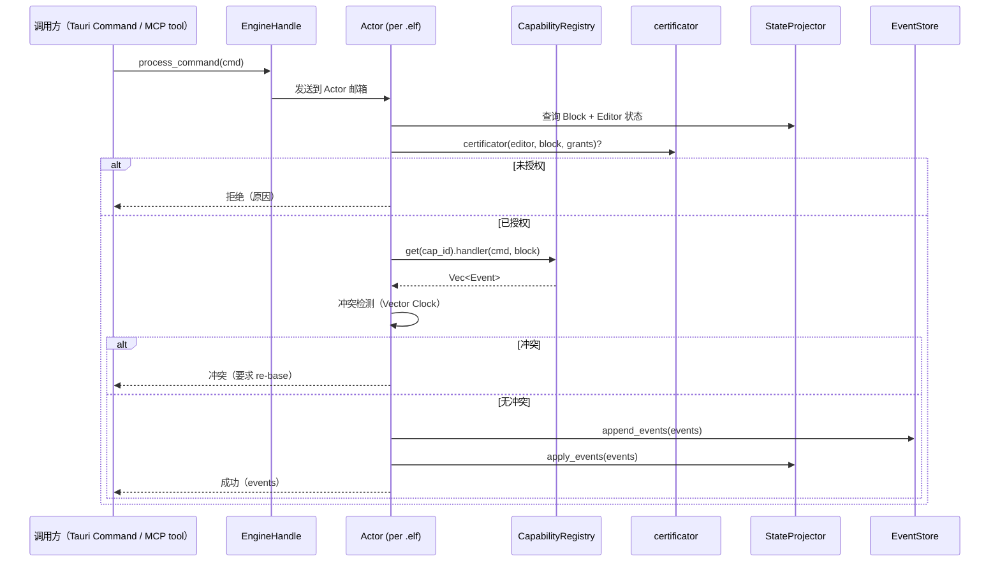
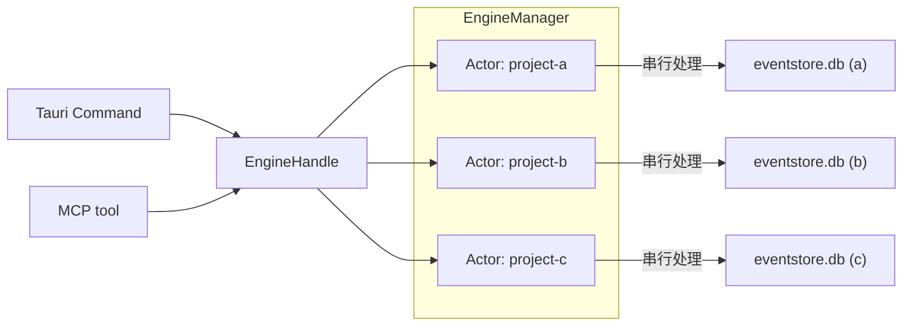
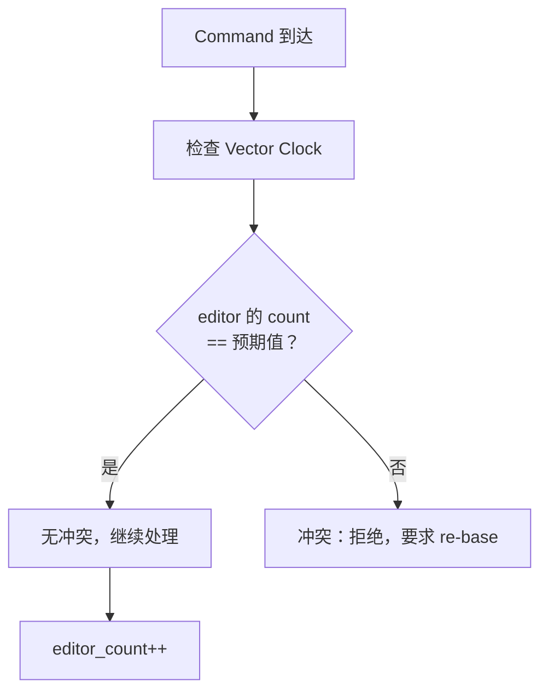

# 引擎架构演进

> Layer 3 — 引擎整合，依赖 L0（data-model）+ L1（event-system, cbac）+ L2（elf-format）。
> 本文档定义命令处理流程、Actor 模型演进、状态投影和冲突处理。

---

## 一、设计原则

**引擎是 Event Sourcing 的执行核心。** 它接收 Command，执行 CBAC 检查，调用 Capability Handler，生成 Event，持久化到 eventstore.db，然后更新内存状态。引擎不关心 Command 从哪里来（Tauri Command 还是 MCP SSE tool call），也不关心 Event 去哪里被消费。

**Actor 模型不变：一个 `.elf` 一个 Actor。** Phase 1 验证了这个模型的正确性——串行处理消除了并发冲突，多文件并行保证了性能。重构保持这个架构不变，只调整引擎内部组件以适配新的 Event 模式和 Block 分类。

---

## 二、命令处理流程

一个 Command 在引擎中的完整生命周期：

> **EngineHandle 是引擎的唯一 API 边界。** 不管 Command 从哪来（Tauri Command、MCP SSE tool call），都通过 EngineHandle 进入 Actor。Engine 层不关心传输层——传输层统一在 L4-communication 中定义（MCP SSE）。

### 与 Phase 1 的差异

| 步骤 | Phase 1 | 重构后 |
|---|---|---|
| 鉴权 | StateProjector.is_authorized()（绕过 certificator） | certificator 两层模型（Owner → Grants）（✅ L1-cbac 已完成） |
| 快照写入 | 在 command 处理后写 block snapshot 物理文件 | 写 CacheStore snapshots 表（✅ L1-event 已完成 CacheStore） |
| `_block_dir` 注入 | 每次操作注入临时目录路径到 contents | 移除（不再需要 per-block 文件目录） |

---

## 三、Actor 模型

### 3.1 架构不变

- **EngineManager**：管理所有 Actor 的生命周期（创建、查询、销毁）
- **Actor**：每个打开的 `.elf` 对应一个 Actor，持有自己的 StateProjector 和 EventStore 连接
- **串行保证**：同一 `.elf` 的所有 Command 在 Actor 内串行处理，无需锁

### 3.2 EngineManager 的职责收束

Phase 1 的 EngineManager 还负责 Agent MCP 服务器管理、Terminal 会话管理等。重构后收束为：

| 职责 | Phase 1 | 重构后 |
|---|---|---|
| Actor 生命周期管理 | 保持 | 保持 |
| Agent MCP 服务器管理 | EngineManager 内部 | 移除（Agent 通过 MCP SSE 连接，由 communication 层管理） |
| Terminal 会话管理 | EngineManager + AppState | 移除（终端执行委托给 AgentContext） |
| 文件信息管理 | EngineManager + DashMap | 简化（.elf/ 目录路径即可，不需要 ElfArchive） |

---

## 四、StateProjector 的演进

> **实现状态**：4.1 mode 处理 ✅ L1-event 已完成，4.2 CacheStore ✅ L1-event 已完成，4.3 内存结构 ✅ L1-cbac 已完成。

StateProjector 维护引擎的内存状态，通过 replay Event 重建。

### 4.1 对 mode 的处理（✅ 已实现）

| Event mode | StateProjector 的处理 |
|---|---|
| `full` | 直接覆盖 Block.contents |
| `delta` | 将 diff apply 到当前 Block.contents 上 |
| `ref` | 更新 Block.contents 中的 hash/path/size 字段（不持有实际内容） |
| `append`（session） | 将新 entry 追加到 Block.contents.entries 列表 |

### 4.2 CacheStore（✅ 已实现）

> 实现为 `CacheStore`（`~/.elf/cache/{project-hash}/cache.db`），不在 `.elf/` 中——只有 eventstore.db 跨机同步。CacheStore 可安全删除，重启时从 Event 重建。

StateProjector 在以下时刻写入 CacheStore snapshots 表：

1. Task 完成时 → 对 Task 及其关联的 Block 打快照
2. Document Block 累积 N 次 delta 后 → 自动打快照
3. 未来可扩展：显式 checkpoint 命令（当前未实现）

快照是派生数据，不影响 Event 处理流程。

### 4.3 新的内存结构（✅ 已实现）

| 组件 | 内容 |
|---|---|
| `blocks` | 所有 Block 的当前状态（从 Event replay 得出） |
| `editors` | 所有 Editor 的当前状态 |
| `grants` | GrantsTable（CBAC 授权表） |
| `editor_counts` | Vector Clock 计数器 |
| `parents` | 反向索引（block_id → 哪些 Block link 到它） |

与 Phase 1 相比，移除了 `system_editor_id` 特殊处理和 `deleted_editors` 集合——鉴权统一在 certificator 两层模型中（Owner → Grants），System Editor 通过 bootstrap 的 `core.grant` 通配符事件获得权限。

---

## 五、冲突处理

### 5.1 当前策略：OCC（乐观并发控制）

- 每个 Editor 维护一个递增的事务计数器
- Command 携带预期的计数值
- 如果预期值与当前值不匹配 → 表示有其他操作先于此 Command 被处理 → 冲突
- 冲突时返回错误，要求客户端重新获取最新状态后重试

### 5.2 为什么 OCC 在当前够用

- 同一 `.elf` 内的命令串行处理（Actor 模型保证）
- 冲突只发生在：同一 Editor 从两个客户端同时发送命令（少见）
- 不同 Editor 之间不存在 OCC 冲突（各自独立的计数器）
- 不同 Agent 操作不同的 Task/Block，通过 CBAC 隔离

### 5.3 预留 CRDT 扩展接口

未来如果需要跨机器的实时协作（参考 Excalidraw 模式），需要 CRDT 支持。当前预留的扩展点：

| 扩展点 | 说明 |
|---|---|
| Event.timestamp 结构 | 已经是 Vector Clock 格式，天然支持 CRDT 所需的因果排序 |
| StateProjector.apply_event | 可扩展为 CRDT merge 逻辑（当前是 last-write-wins） |
| Actor 通讯 | 可扩展为跨机器的 Actor 消息同步 |
| EngineManager | 可扩展为支持远程 Actor 的 proxy |

当前不实现 CRDT，但架构设计不阻碍未来添加。

---

## 六、与 Phase 1 的对比

| 方面 | Phase 1 | 重构后 | 状态 |
|---|---|---|---|
| Actor 模型 | 一个 .elf 一个 Actor | 保持不变 | ✅ |
| 入口 API | EngineHandle | 保持不变（传输层在 L4-communication 定义） | ✅ |
| 鉴权 | is_authorized() + system_editor bypass | certificator 两层（Owner → Grants） | ✅ L1 |
| StateProjector | 只处理全量 Event.value | 适配 full / delta / ref / append 四种模式 | ✅ L1 |
| 快照 | 写物理文件（_snapshot, _blocks_hash） | 写 CacheStore snapshots 表 | ✅ L1 |
| _block_dir 注入 | 每次操作注入临时目录 | 移除 | ✅ L3 |
| write_snapshots | 写物理 .md/.json 文件 | 移除（改用 CacheStore） | ✅ L3 |
| EngineManager 职责 | Actor + Agent MCP + Terminal 管理 | 收束为纯 Actor 生命周期管理 | ✅ L3 |
| 冲突处理 | OCC（Vector Clock） | 保持 OCC，预留 CRDT 接口 | ✅ |
