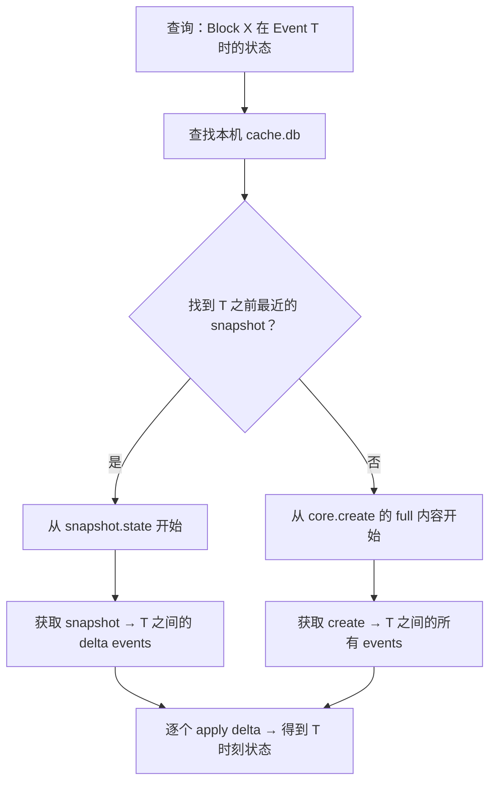

# 事件系统设计

> Layer 1 — 核心机制，仅依赖 L0（data-model）。
> 本文档定义事件的存储、内容模式、快照机制和回溯查询。

---

## 一、设计原则

**Event 是事实唯一来源。** 系统中不存在"当前状态表"——所有状态都是 Event 的投影。这意味着：

- Event 只追加，不修改，不删除
- 任意时刻的系统状态都可以通过回放 Event 精确重建
- Event 不存储推理（reasoning），只存储事实（fact）。推理由消费方（Agent）通过 DAG 遍历 + Vector Clock 关联自行推断

**产品理念契合：**
- **Record（记录）**：EAVT 模型完整记录了"谁在什么时候对什么做了什么"
- **Source of Truth**：Agent 消费 Event 时获得的是确定的事实，而非概率猜测
- **动作即资产**：每个 Event 都是可审计、可回溯、可学习的决策记录

---

## 二、EAVT 模型

每个 Event 由四个核心维度构成：

| 维度 | 字段 | 含义 | 查询场景 |
|---|---|---|---|
| **E**ntity | `entity` | 被变更的对象 ID | "这个 Block 的所有变更历史" |
| **A**ttribute | `attribute` | `"{editor_id}/{cap_id}"` | "这个 Agent 做了哪些操作" |
| **V**alue | `value` | 变更内容（JSON） | "具体改了什么" |
| **T**imestamp | `timestamp` | Vector Clock `{editor_id: count}` | "这个变更和其他变更的因果顺序" |

辅助字段：
- `event_id`：UUID，唯一标识
- `created_at`：ISO 8601 UTC 物理时钟，用于人类可读的排序
- `mode`：内容模式标记（详见 §三）

---

## 三、内容模式（Mode）

Event 的 `mode` 字段标记 `value` 的内容类型，StateProjector 和消费方据此决定如何处理。

### 3.1 四种模式

| mode | 含义 | 适用场景 | 如何获取当前状态 |
|---|---|---|---|
| `full` | 完整内容，可独立读取 | 创建（core.create）、小内容更新（task write）、checkpoint | 直接读取 value |
| `delta` | 增量 diff | 文本文件修改（document.write） | 从最近的 full 基线开始，逐个 apply delta |
| `ref` | 引用（hash + path），不含实际内容 | 二进制文件（图片、PDF、模型等） | Agent 通过 AgentContext 按 hash 从文件系统获取 |
| `append` | 追加条目，不修改已有内容 | Session Block 的记录（对话、命令、决策） | 按因果顺序收集所有 append event 的 value |

### 3.2 模式与 Block 类型的对应

| Block 类型 | core.create | write 操作 | 说明 |
|---|---|---|---|
| `document`（文本） | `full`（完整初始内容） | `delta`（unified diff） | 大文件用 diff 节省空间 |
| `document`（二进制） | `ref`（hash + path） | `ref`（新 hash） | 不存二进制内容本身 |
| `task` | `full` | `full` | 内容小（< 1KB），每次存完整状态 |
| `session` | `full`（空 entries） | `append`（每个 event 是一条新 entry） | 只追加不修改 |

**对应关系的保证方式：** 每个 Capability 的 Handler 在返回 Event 时自行决定 mode。例如 `document.write` handler 内部判断文本 → delta、二进制 → ref；`session.append` handler 固定返回 append。mode 选择是 Handler 实现约定，通过单元测试验证，不做运行时 schema 校验（Handler 是我们控制的代码，不是外部输入）。

### 3.3 Session 的 append 语义

Session Block 使用 `mode: append`。`session.append` 的每个 Event 的 value 是一条 entry：

| entry_type | 含义 |
|---|---|
| `command` | 命令执行记录（command + output + exit_code） |
| `message` | 对话消息（role + content） |
| `decision` | 决策标记（action + related_blocks） |

Session 的当前状态 = 按因果顺序（Vector Clock）收集所有 `mode: append` 事件的 entry。

---

## 四、快照机制

### 4.1 为什么需要快照

当 document.write 使用 `delta` 模式时，获取某个时间点的状态需要从最近的 `full` 基线开始 replay 所有 delta。如果一个文件被修改了 500 次，每次回溯都从创建事件开始 replay 效率太低。

快照记录某个 Block 在某个 Event 之后的完整状态，使回溯查询只需从最近的快照开始 replay。

### 4.2 快照的定位

**快照是本机派生缓存，不是事实来源。**

- 快照可以随时从 Event 重新计算
- 快照**不存储在 `.elf/` 中**——`.elf/` 内的 `_eventstore.db` 是跨机同步的共识数据，快照是本机优化
- 快照存储在本机缓存目录 `~/.elf/cache/{project-hash}/cache.db` 中
- 快照可以被安全地删除——删除后重新打开项目时从 Event 重建

**为什么不放在 `.elf/` 中：**
- `.elf/` 是可分享的单元，里面的内容会被同步到其他机器
- 不同机器可能在不同 event 节点上建快照，放在一起会产生冲突
- Event 用 Vector Clock 处理因果关系，快照如果带物理时钟（created_at）会与 Vector Clock 语义混淆

### 4.3 快照的存储

快照存储在 `~/.elf/cache/{project-hash}/cache.db` 的 `snapshots` 表中：

| 字段 | 含义 |
|---|---|
| `block_id` | 关联的 Block |
| `event_id` | 快照对应到哪个 Event 之后的状态 |
| `state` | 该 Block 的完整 JSON 状态 |

联合主键：`(block_id, event_id)`

无 `created_at` 字段——快照的时序由 `event_id` 对应的 Event 的 Vector Clock 决定。

### 4.4 快照的生命周期

**启动时（打开 `.elf/` 项目）：**

1. 检查 `~/.elf/cache/{project-hash}/cache.db` 是否存在
2. 若存在，加载 snapshots 作为 replay 基线，从最近的 snapshot 对应的 event 开始 replay 后续 events
3. 若不存在（首次打开或缓存被清），从 `_eventstore.db` 的第一个 event 开始全量 replay

**运行时快照触发：**

| 触发点 | 理由 |
|---|---|
| Task 状态变为 `completed` | 任务完成是有意义的断点 |
| 每 N 次 `document.write` | 防止长链 delta replay（N 可配置） |
| 未来可扩展：显式 checkpoint 命令 | 人或 Agent 主动打快照（当前未实现） |

**关闭时：**

将当前内存状态写入 `cache.db` 作为下次启动的加速基线。

### 4.5 回溯查询流程

"获取 Block X 在 Event T 时的状态"：

---

## 五、Event 与 Git 的关系

Event 和 Git 解决不同层次的问题：

| | Event | Git |
|---|---|---|
| 记录频率 | 高（每次操作一个 Event） | 低（人或 Agent 主动 commit） |
| 记录内容 | 决策事实（谁做了什么） | 文件快照（某时刻的完整内容） |
| 粒度 | 单个 Block 的单次变更 | 跨文件的批量变更 |
| 用途 | Agent 消费、因果推理、CBAC 审计 | 版本发布、代码回滚、分支协作 |

**二者的协作：**
- Git commit 可以作为一种特殊的 checkpoint event（记录 commit hash）
- 回溯二进制文件（`ref` 模式）时，Agent 可从 Git 历史中通过 hash 恢复
- Event 链条比 Git 更细粒度、更完整，Git 是可选的外部验证锚点

---

## 六、二进制与大文件策略

### 6.1 处理方式

| 文件类型 | Event 中存什么 | 实际内容在哪 |
|---|---|---|
| 小文本（< 配置阈值） | `mode: full`，存完整内容 | Event 即内容 |
| 大文本 | `mode: delta`，存 diff | 当前状态由 StateProjector 持有（内存） |
| 二进制 | `mode: ref`，只存 hash + path + size | AgentContext 的文件系统 |

### 6.2 二进制文件的回溯

**回溯二进制文件的主体是 Agent，不是 Elfiee。** Elfiee 只负责返回 ref 元数据（hash、path、size），不碰二进制内容本身。

Agent 需要回溯某个二进制文件的历史状态时：
1. 向 Elfiee 查询 Block 状态，获得 `{mode: "ref", hash: "sha256:abc", path: "assets/logo.png", size: 1024}`
2. Agent 通过 AgentContext 在文件系统中查找该文件，hash 匹配则直接读取
3. 若文件已被覆盖/删除，Agent 通过 AgentContext 的 Git 工具按 hash 恢复
4. Elfiee 不维护独立的对象存储（不重复 Git 的功能）

---

## 七、与 Phase 1 的对比

| 方面 | Phase 1 | 重构后 |
|---|---|---|
| Event.value | 总是全量内容，无 mode 标记 | 新增 `mode` 字段（full / delta / ref / append） |
| 快照 | `_snapshot` 文件：人类可读的 markdown 缓存 | 本机 `cache.db`：结构化的 per-block 状态快照，支持任意时间点回溯 |
| 快照位置 | `.elf/` 内 | `~/.elf/cache/` 下，不参与 `.elf/` 同步 |
| 二进制文件 | 存储在 .elf ZIP 内的 block-{uuid}/ 目录 | 不存储内容，Event 只记录 ref（hash + path），Agent 自行访问 |
| 回溯能力 | 只能回放到最新状态 | 支持任意 Event 时间点的精确回溯 |
| Git 关系 | task.commit 直接在 Elfiee 内执行 Git 操作 | Git 操作委托给 AgentContext，Event 只记录 commit hash 作为 checkpoint |
