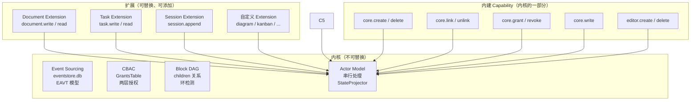

# 扩展系统规范

> Layer 4 — 扩展层，依赖 L3（engine）。
> 本文档明确内核与扩展的边界，定义 Extension 的开发规范和方向指引。

---

## 一、设计原则

**内核小而稳，扩展轻而纯。** Elfiee 的内核是 Event Sourcing + CBAC + Block DAG + Actor Model，这四个部分高度内聚，不轻易变动。Extension 在内核之上添加新的 Block 类型和 Capability，以纯函数的形式运作——接收输入，返回事件，不产生 I/O 副作用。工作 I/O（写文件、跑命令、Git）由 Agent 在 AgentContext 中自行完成，Elfiee 只记录结果。

**产品理念契合：**
- **Agent Building**：Extension 定义了 Agent 能操作的能力集合。每种新的 Block 类型都通过 Extension 引入
- **动作即资产**：Extension 的 Handler 产生的每个 Event 都是可审计的记录
- **Source of Truth**：Extension 不直接修改状态，只通过 Event 间接影响——保证 Event 日志的完整性

---

## 二、内核 vs 扩展的边界



| 类别 | 包含什么 | 可修改性 |
|---|---|---|
| **内核** | Event Store, CBAC, DAG, Actor, StateProjector, 内建 Capability (core.*, editor.*) | 极少修改，向后兼容 |
| **扩展** | 所有 block_type 相关的 Capability（document.*, task.*, session.*, 自定义.*） | 可自由添加和替换 |

---

## 三、Extension 的定义

每个 Extension 需要定义三件事：

### 3.1 Block 内容 Schema

定义该 Block 类型的 `contents` 字段的结构。这决定了 Event.value 中 `full` 模式的内容格式。

| Extension | block_type | contents 结构 |
|---|---|---|
| Document | `document` | `{format, content?, path?, hash?, size?, mime?}` |
| Task | `task` | `{description, status, assigned_to, template?}` |
| Session | `session` | `{entries: [...]}` |

### 3.2 Capability 集合

定义该 Extension 提供的 Capability 列表，每个 Capability 包含：

| 组成 | 说明 |
|---|---|
| `cap_id` | 唯一标识，格式为 `"{extension}.{action}"`（如 `document.write`） |
| `target` | 作用的 block_type（如 `document`） |
| Certificator | 权限检查逻辑（通常委托给 CBAC 默认实现） |
| Handler | 业务逻辑：接收 Command + Block → 返回 Event 列表 |

**Handler 的纯函数约束：**
- 输入：Command（包含 payload）+ Block（当前状态，可选）
- 输出：Vec\<Event\>（生成的事件列表）
- 禁止：文件 I/O、网络请求、进程操作、直接修改状态

**Elfiee 不执行工作 I/O。** 写文件、跑命令、Git 操作等由 Agent 自己在 AgentContext 提供的运行环境中完成（本地 = 直接系统调用，远程 = OneSystem SSH tunnel）。Agent 完成 I/O 后，向 Elfiee 发送 Command 记录决策事实。Elfiee 只负责生产 Event 和持久化到 eventstore.db。

Elfiee 自身唯一的 I/O 是管理 `.elf/` 目录（eventstore.db 读写），这始终是本地操作。

### 3.3 MyST 渲染 Directive

定义该 Block 类型在文学式编程文档中的渲染方式（详见 `literate-programming.md`）。

| Extension | Directive | 渲染效果 |
|---|---|---|
| Document | `` ```{document} block-id `` | 嵌入代码/文档内容，支持 `:lines:` 过滤 |
| Task | `` ```{task} block-id `` | 渲染任务卡片（标题、状态、分配） |
| Session | `` ```{session} block-id `` | 渲染执行记录，支持 `:filter:` 按 entry_type 过滤 |

---

## 四、内建 Extension（重构后保留）

重构后保留 3 个核心 Extension：

| Extension | 保留原因 | 与 Phase 1 的差异 |
|---|---|---|
| **Document** | Content 类 Block 的基础能力 | 统一了 markdown.write/read + code.write/read 为 document.write/read |
| **Task** | Orchestration 的核心工作单元 | 移除 Git 集成（委托给 AgentContext）。保留 task.write/read |
| **Session** | Record 类 Block 的基础能力 | 从 terminal 演进。移除 PTY 管理，只保留 session.append 记录能力 |

**为什么移除 Agent Extension？** Agent 的 prompt/provider/model 配置是 Agent 自身的事务。Elfiee 作为 EventWeaver 只关心 Editor 身份（通过 `editor.create`/`editor.delete`）和权限（通过 `core.grant`/`core.revoke`），不需要存储 Agent 的行为定义。

### 移除的 Extension

| Extension | 移除原因 | 替代方案 |
|---|---|---|
| **Directory** | 文件系统由 AgentContext 管理 | 前端直接查询 AgentContext 获取文件树 |
| **Terminal** | 终端执行由 AgentContext 的 bash session 提供 | Session Block 记录命令和结果，执行交给 AgentContext |

---

## 五、Extension 开发方向指引

### 5.1 可扩展的方向

围绕三类 Block 扩展：

**Content 类（新的文档格式）：**
- `diagram`：Mermaid / Excalidraw 图表
- `spreadsheet`：表格数据
- `canvas`：自由画布

**Orchestration 类（新的编排方式）：**
- `workflow`：显式工作流定义（DAG 可视化）
- `review`：代码审查流程
- `approval`：审批流程

**Record 类（新的记录方式）：**
- `metric`：指标记录（FPY、耗时等）
- `changelog`：变更日志自动生成

### 5.2 Extension 设计原则

| 原则 | 说明 |
|---|---|
| **纯函数** | Handler 只接收输入、返回事件。无 I/O 副作用 |
| **单一职责** | 一个 Extension 对应一个 block_type |
| **Schema 明确** | contents 的结构必须有明确的类型定义，不使用任意 JSON |
| **CBAC 兼容** | 所有 Capability 遵循标准的 Certificator 逻辑 |
| **可测试** | 因为是纯函数，每个 Handler 都可以独立单元测试（给定输入 → 验证输出事件） |

---

## 六、与 Phase 1 扩展系统的对比

| 方面 | Phase 1 | 重构后 |
|---|---|---|
| Extension 可做什么 | 事件生产 + I/O 操作（文件读写、PTY、Git） | 纯事件生产（I/O 委托给 AgentContext） |
| Capability 数量 | 35+（含大量 I/O 操作） | 大幅减少（仅保留事件生产类） |
| 测试难度 | 需要文件系统、PTY、Git 环境 | 纯函数单元测试，无外部依赖 |
| block_type 数量 | 6 种 | 3 种（document / task / session） |
| Payload 类型 | 散布在各 Extension 中 | 保持在各 Extension 中，统一 Schema 规范 |
| 注册方式 | 编译时注册到 CapabilityRegistry | 保持不变 |
| MyST Directive | 未定义 | 每个 Extension 必须定义渲染 Directive |
