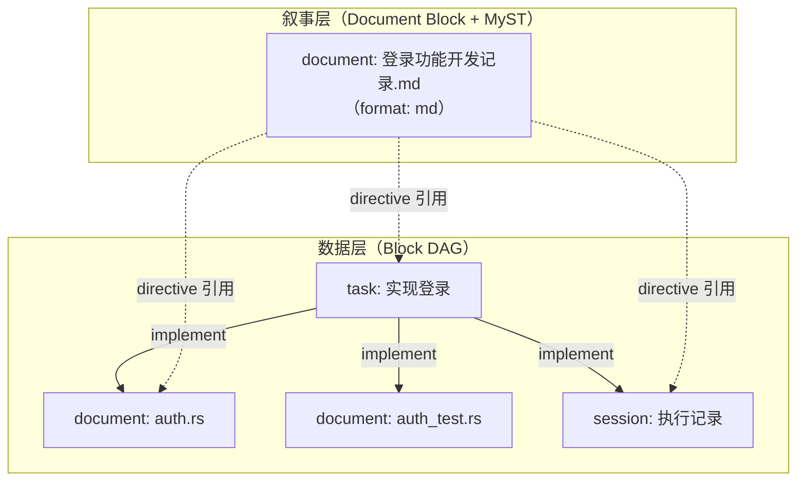
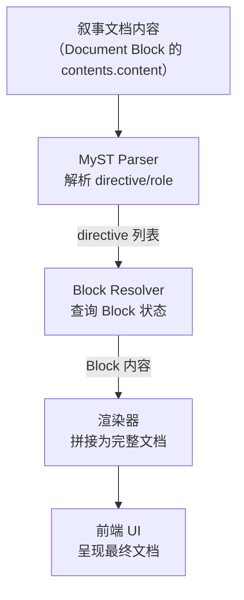

# 文学式编程的实现

> Layer 5 — 应用层，依赖 L4（extension-system）+ L0（data-model）。
> 本文档定义 Block DAG + MyST 叙事渲染的文学式编程模型。

---

## 一、设计原则

**代码和叙事分离存储，按需编织。** 传统文学式编程（Knuth 的 WEB/CWEB）将代码和解释混在同一个文件中。Elfiee 的方式不同：代码、任务、会话记录各自是独立的 Block，通过 DAG link 建立因果关系。当需要呈现为一篇可读文档时，使用 MyST directive 将 Block 内容拉入叙事文档中，按作者的意图编排。

**产品理念契合：**
- **Source of Truth**：Block 是数据层的事实来源，叙事文档是渲染层的视图——两者分离，避免了"修改文档就修改了代码"的混淆
- **Record**：叙事文档本身也是一个 Document Block，享有 Event Sourcing 的完整追溯能力
- **动作即资产**：叙事编织的过程（选择哪些 Block、以何种顺序组合）本身就是决策记录

---

## 二、两层架构



| 层 | 职责 | 存储方式 |
|---|---|---|
| **数据层** | Block 独立存储内容，DAG link 建立因果关系 | 各 Block 的 Event 流 |
| **叙事层** | Document Block 使用 MyST directive 引用其他 Block，编排为可读文档 | 叙事文档本身的 Event 流 |

**关键特性：** 叙事文档是 Block，不是特殊的元数据。它可以被 link、被 grant、被 event 追溯——和任何其他 Block 一样。

---

## 三、MyST Directive 体系

MyST（Markedly Structured Text）是 Markdown 的结构化扩展，支持 directive（块级指令）和 role（行内角色）。Elfiee 利用 MyST 的 directive 机制在叙事文档中引用 Block 内容。

### 3.1 每个 Extension 定义自己的 Directive

这是 Extension 系统（`extension-system.md`）要求的三件事之一。每个 Extension 需要定义其 Block 类型在叙事文档中的渲染 Directive。

| Extension | Directive 语法 | 渲染效果 |
|---|---|---|
| Document | `` ```{document} block-id `` | 嵌入代码/文档内容 |
| Task | `` ```{task} block-id `` | 渲染任务卡片（标题、状态、分配、关联 Block） |
| Session | `` ```{session} block-id `` | 渲染执行记录（命令、对话、决策标记） |
| Agent | `` ```{agent} block-id `` | 渲染 Agent 信息卡片（prompt 摘要、能力、状态） |

### 3.2 Directive 参数

Directive 支持参数来控制渲染范围：

| 参数 | 适用 Directive | 含义 |
|---|---|---|
| `:lines:` | document | 只显示指定行范围（如 `:lines: 10-25`） |
| `:filter:` | session | 按 entry_type 过滤（如 `:filter: command,decision`） |
| `:collapse:` | 所有 | 默认折叠，点击展开 |
| `:caption:` | 所有 | 自定义标题（覆盖 Block name） |

### 3.3 叙事文档示例

一个使用 MyST directive 编排的文学式文档：

```markdown
# 登录功能开发记录

## 需求背景

本功能的目标是为项目添加 OAuth2 登录支持。

```{task} task-uuid-001
:caption: 任务定义
```

## 实现方案

认证模块的核心逻辑如下：

```{document} doc-uuid-001
:lines: 15-45
:caption: auth.rs - OAuth2 处理逻辑
```

## 执行过程

以下是 Agent 完成任务的关键步骤：

```{session} session-uuid-001
:filter: decision,command
:caption: coder-agent 执行记录
```

## 测试验证

```{document} doc-uuid-002
:caption: auth_test.rs - 测试用例
```
```

---

## 四、渲染流程

### 4.1 前端渲染管线



| 步骤 | 输入 | 输出 | 说明 |
|---|---|---|---|
| **解析** | 叙事文档的 Markdown 文本 | directive 列表（block_id + 参数） | 标准 MyST 解析，识别自定义 directive |
| **查询** | block_id 列表 | 各 Block 的当前状态 | 通过 Engine 查询（StateProjector 提供） |
| **渲染** | Block 状态 + directive 参数 | 最终 HTML/组件 | 每种 block_type 的渲染逻辑由 Extension 定义 |

### 4.2 实时更新

当引用的 Block 发生变更时：

1. Engine 广播 `state.changed` 通知
2. 前端检查变更的 block_id 是否被当前打开的叙事文档引用
3. 如果是 → 重新查询该 Block 状态 → 局部重新渲染

叙事文档本身不需要修改——因为 directive 引用的是 block_id，内容从 Block 动态拉取。

---

## 五、与 Block DAG 的协作

### 5.1 DAG 提供因果上下文

叙事文档中的 directive 直接引用 block_id，但 Block DAG 提供了额外的导航能力：

| 场景 | DAG 的作用 |
|---|---|
| 读者想了解某段代码的来源 | 通过 document Block 的 DAG 反向遍历，找到关联的 task Block |
| 读者想查看完整的执行过程 | 通过 task Block 的 children 遍历，找到所有关联的 session Block |
| Agent 生成叙事文档 | 遍历 task 的 implement DAG，自动发现需要引用的 Block |

### 5.2 自动叙事生成

Agent 可以通过以下流程自动生成叙事文档：

1. 选择一个 Task Block 作为起点
2. 遍历其 implement DAG，收集所有关联的 Block
3. 按 Event timestamp 排序，确定叙事顺序
4. 生成包含 MyST directive 的 Markdown 内容
5. 创建一个新的 Document Block 存储叙事

人类作为 Reviewer 审查并调整叙事结构（增删 directive、调整顺序、添加解说文字）。

---

## 六、与传统文学式编程的对比

| 方面 | Knuth WEB/CWEB | Phase 1 Elfiee | 重构后 Elfiee |
|---|---|---|---|
| 代码与叙事的关系 | 同一文件，交织存储 | Block 独立存储，无叙事机制 | Block 独立存储，MyST directive 编织叙事 |
| 叙事编辑 | 修改源文件 | 不支持 | 编辑叙事 Document Block（不影响被引用的 Block） |
| 内容更新 | 手动同步 | — | directive 动态拉取，自动同步 |
| 多视角 | 一个文件一个视角 | — | 多个叙事文档可引用同一组 Block，呈现不同视角 |
| 权限 | 无 | — | 叙事文档和被引用 Block 各自有独立的 CBAC 权限 |
| 追溯 | 无 | — | 叙事文档的编辑历史本身也是 Event 链 |
| 参与者 | 人类 | — | 人类编排 + Agent 自动生成 + 人类 Review |

---

## 七、叙事文档的产品价值

### 7.1 对人类

- **决策记录的可读呈现**：将散落在各 Block 中的信息编排为有叙事逻辑的文档，便于回顾和分享
- **知识传递**：新成员通过阅读叙事文档，快速理解功能的设计思路、实现过程和验证结果
- **Dogfooding 报告**：Dogfooding 过程的记录可以自动编排为结构化报告

### 7.2 对 Agent

- **上下文压缩**：Agent 需要理解某个功能时，叙事文档提供了人类整理过的精炼视角，比遍历全部 Event 更高效
- **Skill 学习素材**：叙事文档是从执行过程中提炼的结构化总结，是 Skill 生产的输入之一

---

## 八、与 Phase 1 的对比

| 方面 | Phase 1 | 重构后 |
|---|---|---|
| 文学式编程 | 未实现 | Block DAG + MyST directive 编织叙事 |
| MyST 支持 | 未实现 | Extension 必须定义 MyST Directive |
| 叙事文档 | 无 | Document Block（format: md）使用 directive 引用其他 Block |
| 渲染 | Block 各自独立渲染 | 支持叙事文档的 directive 解析和 Block 内容拼接 |
| 自动生成 | 无 | Agent 遍历 DAG 自动生成叙事草稿，人类 Review |
