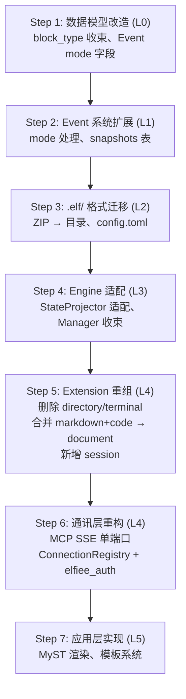

# 迁移与瘦身清单

> Layer 6 — 迁移规划，依赖全部前序文档。
> 本文档列出 Phase 1 代码的删除/保留/改造清单，以及迁移顺序和风险评估。

---

## 一、设计原则

**先瘦身，再扩展。** 重构的第一步不是添加新功能，而是删除不再属于 Elfiee 职责的代码。Elfiee 从"全能桌面编辑器"收束为"EventWeaver（事件织机）"——所有文件系统管理、终端 PTY 托管、Git 集成、MCP 多端口管理都应该被移除或委托。

**迁移顺序遵循 Layer 依赖：** 从最底层（L0 数据模型）开始改造，逐步向上推进。每一层完成后都可以独立测试，不依赖后续层。

---

## 二、删除清单

以下代码将被完整删除，不保留。

### 2.1 Directory Extension（整个目录）

**路径：** `src-tauri/src/extensions/directory/`

| 文件 | 包含的 Capability | 删除理由 |
|---|---|---|
| `directory_import.rs` | `directory.import` | 文件系统扫描委托给 AgentContext |
| `directory_export.rs` | `directory.export` | 文件导出委托给 AgentContext |
| `directory_write.rs` | `directory.write` | 目录内容管理委托给 AgentContext |
| `directory_create.rs` | `directory.create` | 目录创建委托给 AgentContext |
| `directory_delete.rs` | `directory.delete` | 目录删除委托给 AgentContext |
| `directory_rename.rs` | `directory.rename` | 目录重命名委托给 AgentContext |
| `directory_rename_with_type_change.rs` | `directory.rename_with_type_change` | 同上 |
| `fs_scanner.rs` | — | 文件系统扫描工具 |
| `elf_meta.rs` | — | .elf 元数据管理 |
| `tests.rs` | — | 相关测试 |
| `mod.rs` | — | 模块定义和 Payload 类型 |

**替代方案：** 前端直接查询 AgentContext 获取文件树。Agent 通过 AgentContext 的 FileSystem 接口操作文件。

### 2.2 Terminal Extension（整个目录）

**路径：** `src-tauri/src/extensions/terminal/`

| 文件 | 包含的功能 | 删除理由 |
|---|---|---|
| `terminal_init.rs` | `terminal.init` capability | PTY 管理委托给 AgentContext |
| `terminal_execute.rs` | `terminal.execute` capability | 命令执行委托给 AgentContext |
| `terminal_save.rs` | `terminal.save` capability | 内容保存改为 Session.append |
| `terminal_close.rs` | `terminal.close` capability | PTY 生命周期委托给 AgentContext |
| `pty.rs` | PTY 工具函数（spawn/write/resize/close） | 全部委托给 AgentContext |
| `commands.rs` | Tauri 命令（write_to_pty/resize_pty/close_pty_session） | 实时 PTY 操作委托给 AgentContext |
| `state.rs` | TerminalState/TerminalSession 全局状态 | 不再需要 |
| `tests.rs` | — | 相关测试 |
| `mod.rs` | — | 模块定义和 Payload 类型 |

**替代方案：** 终端执行通过 AgentContext 的 Bash Session 进行。执行结果通过 `session.append` 记录在 Session Block 中。

### 2.3 MCP SSE 多端口基础设施

**路径：** `src-tauri/src/mcp/`

| 文件 | 包含的功能 | 删除理由 |
|---|---|---|
| `transport.rs` | `start_agent_mcp_server`、`allocate_agent_port` | 每 Agent 独立端口的 SSE 服务器被 MCP SSE 单端口（`elf serve`）替代 |
| `server.rs` | MCP tool 注册和 `elfiee_exec` handler | 重构为 MCP SSE Server 中的 tool handler |

**替代方案：** MCP SSE Server（`communication.md`）。所有客户端共用单端口。

### 2.4 Agent Extension 中的 MCP 相关代码

**路径：** `src-tauri/src/extensions/agent/`

| 文件 | 删除的部分 | 保留的部分 |
|---|---|---|
| `mcp_config.rs` | `.mcp.json` 读写、端口管理 | — |
| `settings_config.rs` | Agent 配置注入到外部工具（.claude 等） | — |

### 2.5 Task Extension 中的 Git 集成

**路径：** `src-tauri/src/extensions/task/`

| 文件 | 删除的部分 | 保留的部分 |
|---|---|---|
| `task_commit.rs` | `task.commit` capability（Git branch/add/commit） | — |
| `git.rs` | Git 操作工具函数 | — |
| `git_hooks.rs` | Git hook 注入 | — |

**替代方案：** Git 操作委托给 AgentContext。commit hash 作为 `decision` entry 记录在 Session Block 中。

### 2.6 前端 Commands 中的 I/O 操作

**路径：** `src-tauri/src/commands/`

| 文件 | 删除/改造 | 说明 |
|---|---|---|
| `file.rs` | 删除 | 文件操作委托给 AgentContext |
| `checkout.rs` | 删除 | .elf 文件 checkout 流程需要基于新的 .elf/ 目录格式重写 |
| `agent.rs` | 大幅改造 | 移除 MCP 服务器启停、.mcp.json 管理、symlink 管理 |
| `task.rs` | 改造 | 移除 Git 集成部分 |

---

## 三、保留清单

以下代码保持不变或微调。

### 3.1 Engine 核心（保持）

**路径：** `src-tauri/src/engine/`

| 文件 | 状态 | 说明 |
|---|---|---|
| `actor.rs` | 保持 | Actor 模型不变（一个 .elf 一个 Actor） |
| `event_store.rs` | 保持 | Event 存储逻辑不变 |
| `manager.rs` | 改造 | 移除 Agent MCP 管理职责，收束为纯 Actor 生命周期管理 |
| `state.rs` | 改造 | StateProjector 适配新的 Event mode（delta/ref/append） |

### 3.2 数据模型（保持 + 扩展）

**路径：** `src-tauri/src/models/`

| 文件 | 状态 | 说明 |
|---|---|---|
| `block.rs` | ✅ 已完成 | block_type 改为 String（6 种收束为 3 种）。metadata 移除，改为 description |
| `event.rs` | ✅ 已完成 | 添加 `mode` 字段（Full/Delta/Ref/Append） |
| `editor.rs` | 保持 | 无变化 |
| `command.rs` | 保持 | 统一消息格式的内部表示 |
| `grant.rs` | 保持 | 无变化 |
| `capability.rs` | 保持 | 无变化 |
| `payloads.rs` | ✅ 已完成 | 移除 UpdateMetadata/Rename/ChangeType payload，新增 WriteBlockPayload |
| `metadata.rs` | ✅ 已删除 | BlockMetadata 结构冗余，created_at/updated_at 应从 event 派生 |

### 3.3 保留的 Extension

| Extension | 路径 | 状态 | 变更 |
|---|---|---|---|
| **Markdown** | `extensions/markdown/` | 合并 | 与 Code 合并为 Document Extension |
| **Code** | `extensions/code/` | 合并 | 与 Markdown 合并为 Document Extension |
| **Agent** | `extensions/agent/` | 待删除 | Agent Block 已从数据模型移除。Agent 配置是 Agent 自身事务，不属于 Elfiee |
| **Task** | `extensions/task/` | 改造 | 移除 Git 集成。保留 task.write/task.read |

### 3.4 核心 Capability（保持）

| Capability | 路径 | 状态 |
|---|---|---|
| `core.create` | `builtins/create.rs` | 保持 |
| `core.delete` | `builtins/delete.rs` | 保持 |
| `core.write` | `builtins/write.rs` | ✅ 新建（合并 rename + change_type + update_metadata） |
| `core.link` | `builtins/link.rs` | 保持 |
| `core.unlink` | `builtins/unlink.rs` | 保持 |
| `core.grant` | `builtins/grant.rs` | 保持 |
| `core.revoke` | `builtins/revoke.rs` | 保持 |
| `editor.create` | `builtins/editor_create.rs` | 保持 |
| `editor.delete` | `builtins/editor_delete.rs` | 保持 |

**已删除的 Capability（4 个）：** `core.read`、`core.rename`、`core.change_type`、`core.update_metadata`

---

## 四、新增清单

以下是需要新增的模块。

| 模块 | 层级 | 说明 |
|---|---|---|
| **Document Extension** | L4 | 合并 Markdown + Code，添加 `format` 字段支持，添加 delta 模式处理 |
| **Session Extension** | L4 | 新增。`session.append` capability，append-only 语义 |
| **MCP SSE Server** | L4 | 重构。单端口 MCP SSE 服务器，ConnectionRegistry，`elfiee_auth` per-connection 认证 |
| **Checkpoint 机制** | L3 | 新增。CacheStore snapshots 表（✅ 已实现）。`core.checkpoint` capability（未来扩展） |
| **MyST Parser** | L5 | 新增。前端 directive 解析和 Block 内容拼接（前端模块） |
| **模板系统** | L5 | 新增。`.elf/templates/` 读取、解析和实例化 |

---

## 五、迁移顺序

按 Layer 依赖顺序逐步推进，每一步完成后可独立验证。

### 每步的验证标准

| 步骤 | 验证方式 | 通过标准 |
|---|---|---|
| Step 1 | 单元测试 | 新的 Block 类型序列化/反序列化正确，Event mode 字段可解析 |
| Step 2 | 集成测试 | full/delta/ref 三种模式的 Event 写入和 replay 正确，snapshots 表可读写 |
| Step 3 | 集成测试 | .elf/ 目录可正确初始化，eventstore.db 可在目录中创建和打开 |
| Step 4 | 集成测试 | 完整 command → authorize → execute → persist → project 流程通过 |
| Step 5 | 单元测试 | document.write 的 delta 模式正确，session.append 正确，旧 capability 已移除 |
| Step 6 | 集成测试 | MCP SSE 连接建立、`elfiee_auth` 认证、tool call 路由到 Actor 全流程通过 |
| Step 7 | 端到端测试 | 叙事文档中的 directive 正确解析和渲染，模板实例化生成正确的 Event |

---

## 六、风险评估

| 风险 | 影响 | 缓解策略 |
|---|---|---|
| **.elf 格式不兼容** | Phase 1 的 .elf 文件（ZIP 归档）无法在新系统中打开 | 提供一次性迁移工具：解压 ZIP → 提取 eventstore.db → 放入 .elf/ 目录 |
| **block_type 收束** | 现有 directory/terminal 类型的 Block 失去对应的 Extension | 迁移时将 directory Block 标记为归档（不删除 Event），terminal Block 转换为 session Block |
| **markdown + code 合并** | 现有的 `markdown.write`、`code.write` capability 调用需要全部改为 `document.write` | Event replay 时做兼容映射：遇到旧 cap_id 自动映射为新 cap_id |
| **MCP SSE 重构** | 当前 per-agent 端口模型需要重构为单端口 + per-connection 认证 | MCP SSE 保留为唯一协议，重构为 `elf serve` + ConnectionRegistry + `elfiee_auth` |
| **Git 操作委托** | task.commit 不再在 Elfiee 内执行 Git 操作 | Git 操作由 AgentContext 执行后，通过 Session Block 记录 commit hash，保持可追溯性 |

---

## 七、删除量估算

| 类别 | 估算文件数 | 估算代码行 |
|---|---|---|
| **删除（directory extension）** | ~12 文件 | ~2000 行 |
| **删除（terminal extension）** | ~10 文件 | ~1500 行 |
| **删除（MCP SSE 基础设施）** | ~3 文件 | ~800 行 |
| **删除（agent MCP 配置）** | ~2 文件 | ~400 行 |
| **删除（task Git 集成）** | ~3 文件 | ~600 行 |
| **删除（file/checkout commands）** | ~2 文件 | ~300 行 |
| **总删除** | **~32 文件** | **~5600 行** |
| **改造** | ~10 文件 | ~1500 行变更 |
| **新增** | ~15 文件 | ~3000 行 |

**净效果：** 代码量大幅减少（~5600 删除 + 3000 新增 = 净减 ~2600 行），同时职责更清晰、可测试性更强。

---

## 八、与 Phase 1 的对比

| 方面 | Phase 1 | 重构后 |
|---|---|---|
| Extension 数量 | 6 个（markdown/code/directory/terminal/agent/task） | 3 个（document/task/session） |
| Capability 数量 | 35+（含大量 I/O 操作） | 大幅减少（只保留纯事件生产类） |
| 外部依赖 | portable-pty、git2（嵌入式） | 无（I/O 委托给 AgentContext） |
| 连接方式 | Tauri IPC + MCP SSE（per-agent 端口） | MCP SSE 单端口（`elf serve`，所有客户端平等） |
| .elf 格式 | ZIP 归档（自包含） | .elf/ 目录（类 .git/） |
| 代码量 | ~12000 行 Rust | 估算 ~9000 行 Rust（净减 ~25%） |
