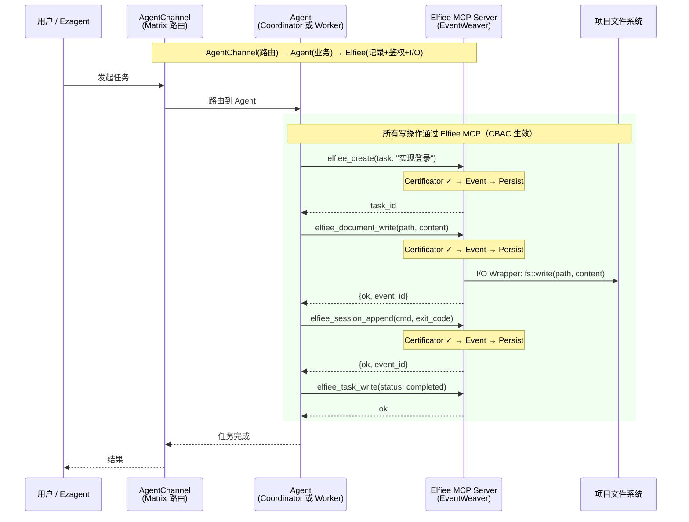
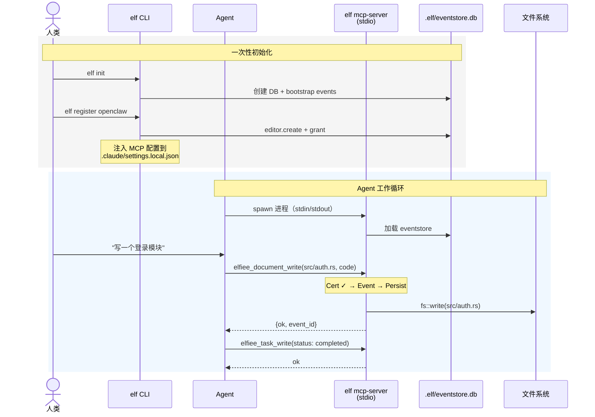
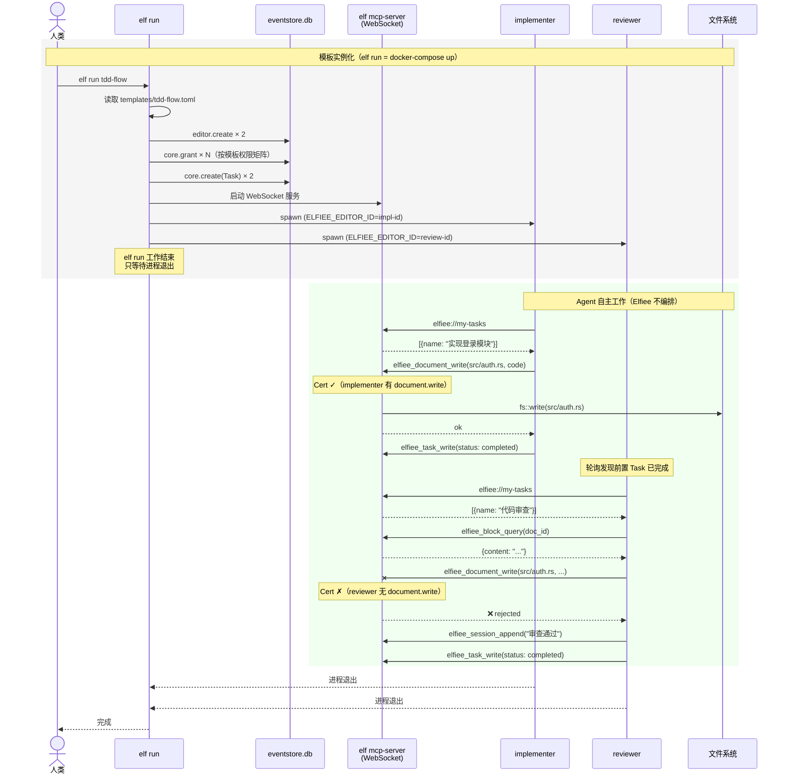
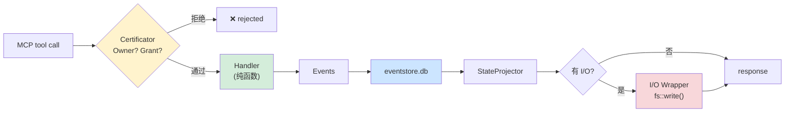

# Elfiee 架构定位与使用数据流

> 基于重构设计（目标态）。
> Elfiee = EZAgent 体系中的 **EventWeaver** 组件，专注 Event Sourcing + CBAC + Block DAG。
> 核心机制：**MCP tool = Event + I/O（替代，非叠加）**——Agent 通过 Elfiee MCP 写文件，Elfiee 先鉴权再执行 I/O。

---

## 图 1：Elfiee 在 EZAgent 三层架构中的定位



### 关键：I/O 控制在 Elfiee 内部

```
Agent 不直接写文件。写操作通过 Elfiee MCP tool 替代原生操作：

  Agent ──MCP tool call──→ Elfiee ──I/O Wrapper──→ 文件系统
                             │
                       Certificator（CBAC 鉴权）
                       Handler（纯函数 → Event）
                       Persist（eventstore.db）

无 Capability Grant = 无法写文件（鉴权在 I/O 之前）。
```

| Agent 类型 | 如何确保走 Elfiee MCP | CBAC 覆盖率 |
|---|---|---|
| OpenClaw（开源） | 改造源码：替换原生 Write 为 Elfiee tool | 100% |
| Claude Code（闭源） | system prompt 引导 + MCP tools 优先 | ~75%（prompt 不完美） |

### EZAgent 概念映射

| EZAgent | Elfiee |
|---|---|
| Socialware（可编程组织） | `.elf/templates/`（工作模板） |
| Identity（平等身份） | Editor（人 = Agent） |
| Room（协作空间） | `.elf/` 项目 |
| Flow（状态机） | Task 状态流转 + CBAC |

---

## 图 2：Elfiee 自身使用方式

### 2a. 本地单 Agent（stdio 模式）



### 2b. 多 Agent 协作（WebSocket + 模板驱动）

**模板示例**（`.elf/templates/tdd-flow.toml`）：

```toml
[template]
name = "tdd-flow"
description = "TDD 工作流：实现者写代码，审查者 review"

[[roles]]
name = "implementer"
agent_type = "openclaw"
capabilities = ["document.write", "session.append", "task.write"]

[[roles]]
name = "reviewer"
agent_type = "openclaw"
capabilities = ["document.read", "session.append", "task.write"]

[[tasks]]
name = "实现登录模块"
assigned_to = "implementer"
description = "实现 OAuth2 登录，含单元测试"

[[tasks]]
name = "代码审查"
assigned_to = "reviewer"
depends_on = "实现登录模块"
description = "审查代码质量和测试覆盖率"
```

**模板实例化 = 生成一系列 Event（Socialware 声明 → Event 流）：**

```
elf run tdd-flow 执行过程：

1. 读取 .elf/templates/tdd-flow.toml
2. 写入 bootstrap events 到 eventstore.db：
   ├── editor.create("implementer")      ← 为每个角色创建 Editor
   ├── editor.create("reviewer")
   ├── core.grant(implementer, document.write, *)  ← 按模板权限矩阵
   ├── core.grant(implementer, session.append, *)
   ├── core.grant(reviewer, document.read, *)
   ├── core.create(Task: "实现登录模块", assigned_to=implementer)
   └── core.create(Task: "代码审查", assigned_to=reviewer)
3. 启动 elf mcp-server --ws
4. spawn Agent 进程（每个携带 ELFIEE_EDITOR_ID）
5. 等待所有进程退出
```

**时序图：**



> **注意**：reviewer 尝试写文件被 CBAC 拒绝——模板中只授予了 `document.read`，没有 `document.write`。权限矩阵在模板实例化时通过 `core.grant` Event 写入，运行时由 Certificator 强制执行。

### 2c. Engine 内部处理流

每个 MCP tool call 的处理链：



---

## 总结

### 使用方式

| 方式 | 命令 | 传输 | 场景 |
|---|---|---|---|
| 单 Agent | Agent 自动 spawn `elf mcp-server` | stdio | 日常开发 |
| 多 Agent | `elf run <template>` | WebSocket | 模板驱动协作 |
| GUI | Tauri 桌面应用 | WebSocket | 可视化查看 |
| CLI | `elf status` | 直读 .elf/ | 快速检查 |

### Elfiee 做什么 / 不做什么

```
✓ Event Sourcing  — 记录决策事实到 eventstore.db
✓ CBAC            — 鉴权后才执行 I/O，阻止越权
✓ Block DAG       — 结构化内容关联
✓ I/O Wrapper     — 代理 Agent 执行文件写入（CBAC 控制入口）
✓ 工作模板        — 声明角色/权限/流程

✗ Agent 运行时    → AgentContext
✗ bash/git 执行   → Agent 自行完成，事后 session_append 报告
✗ 消息路由        → AgentChannel
✗ 模板市场        → Synnovator
```
