# Unified Framework: 四平台架构与数据流

## 一、四平台定位

| 平台 | 关注点 | 核心能力 | 运行位置 |
|------|--------|----------|----------|
| **Synnovator** | 社群 & 内容 | 帖子发布、页面管理、模板市场、社区展示 | 云端 Web |
| **Matrix Com** | 通讯 & 路由 | /命令分发、Agent 托管、群聊/单聊、事件桥接 | 自托管/云端 |
| **Elfiee** | 本地智能 & Agent 编排 | 事件溯源、CBAC 权限、多 Agent 模板、Skill 演化 | 本地桌面 |
| **One System** | 资源 & 运行时 | Secret 管理、SSH 隧道、卷挂载、Agent 运行环境 | 自托管 |

**核心设计原则**：Matrix 是消息总线，不是业务逻辑层。各平台保持独立可运行，Matrix 负责连接和路由。

---

## 二、分层架构

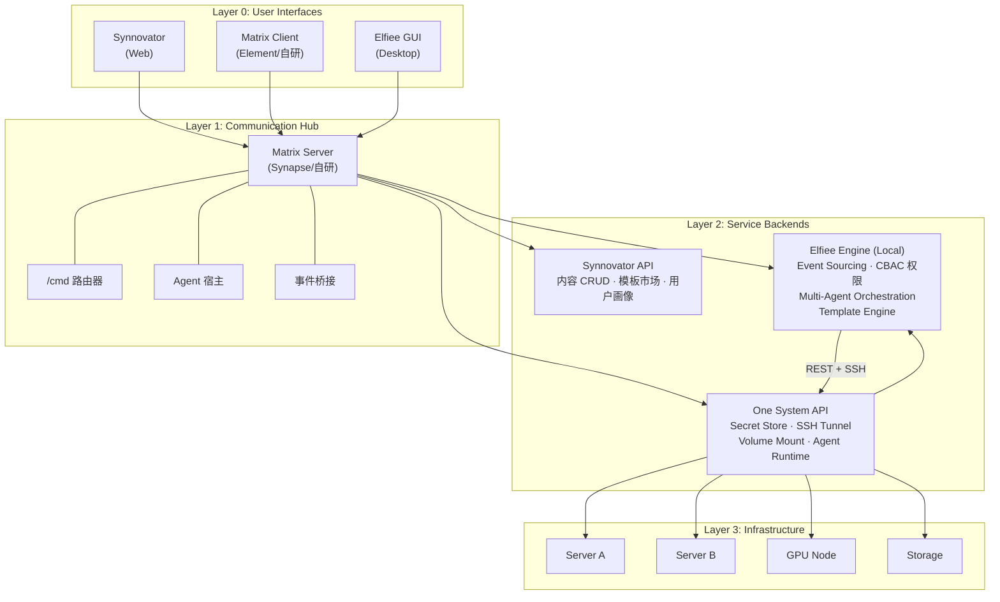

---

## 三、Matrix 中心路由模型

Matrix 作为消息总线，不持有业务状态，只做三件事：**转发、路由、托管 Agent**。

### 3.1 /命令路由表

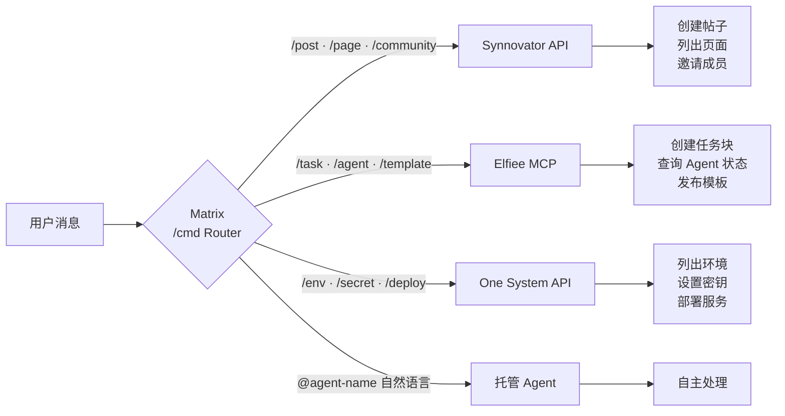

### 3.2 Agent 在 Matrix 中的角色

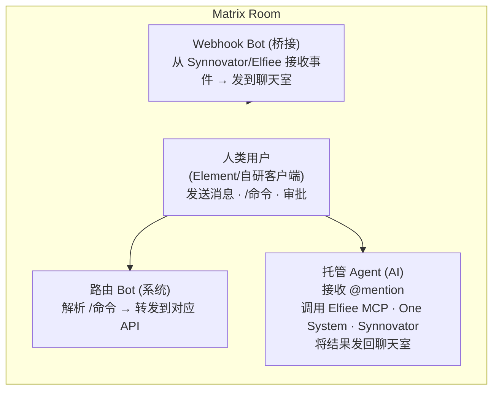

---

## 四、核心数据流

### 4.1 全局数据流向

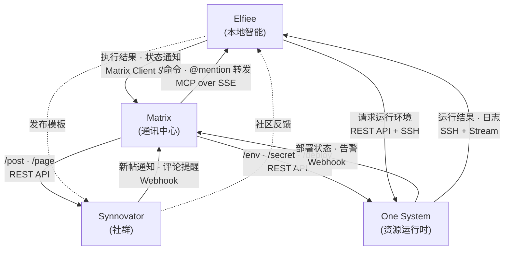

### 4.2 四平台综合数据流时序图

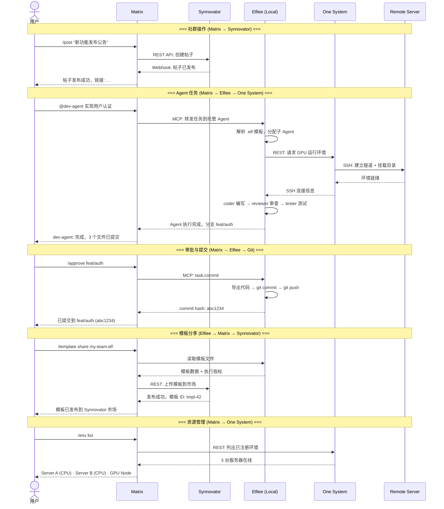

### 4.3 典型场景：Agent 协作开发

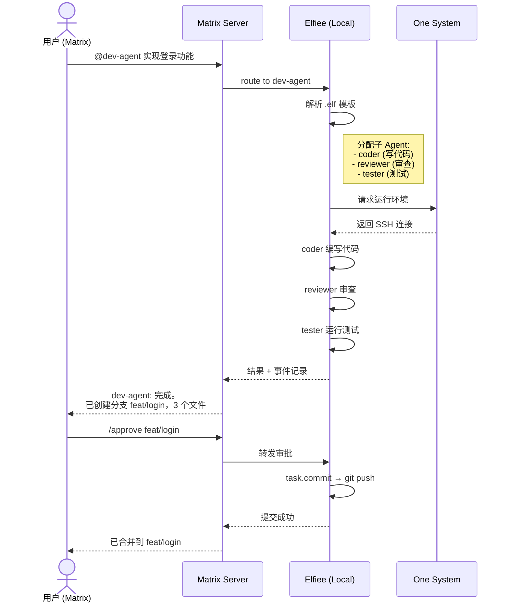

### 4.4 典型场景：模板分享与演化

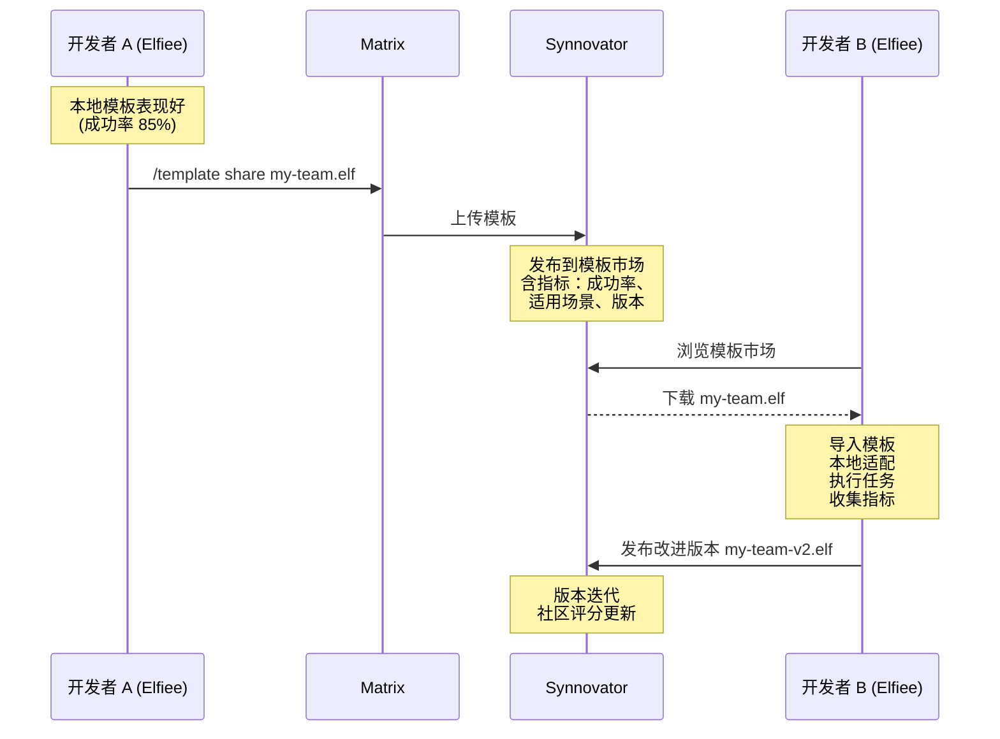

---

## 五、Elfiee 模板系统：多 Agent 编排

这是整个架构中最核心的创新点。Elfiee 不仅是编辑器，更是 **Agent 组织的定义和演化平台**。

### 5.1 模板文件结构

`.elf` 模板文件定义一个多 Agent 组织的完整规格：

```
team-template.elf/
├── _eventstore.db              # 事件日志（含初始化事件）
├── agents/
│   ├── coordinator.md          # 协调者：任务拆分、分配、汇总
│   ├── coder.md                # 执行者：代码编写
│   ├── reviewer.md             # 审查者：代码审查
│   └── tester.md               # 验证者：测试执行
├── rules/
│   ├── workflow.md             # 工作流定义（DAG）
│   ├── permissions.md          # 权限矩阵
│   └── evolution-policy.md     # 演化策略
└── skills/
    ├── code-review.md          # 可复用 skill
    └── test-driven.md          # TDD 流程 skill
```

### 5.2 Agent 演化路径

对应图中的 Agent 0 → 1 → 2 进化路线：

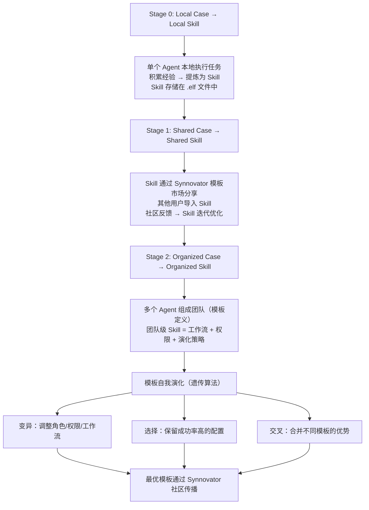

### 5.3 模板在四平台间的流转

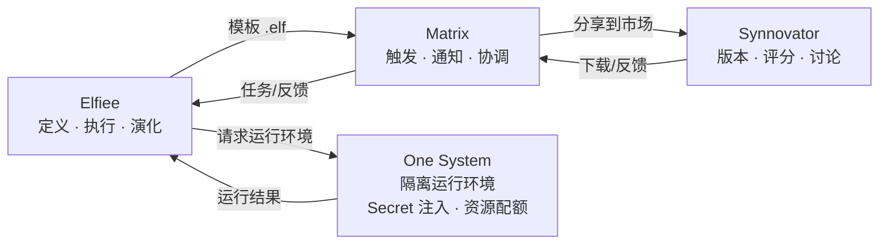

---

## 六、One System 的精准定位

**原则**：不做重型资源编排（交给 k8s/docker-compose），专注 Agent 运行时的三个痛点。

| 职责 | 做什么 | 不做什么 |
|------|--------|----------|
| **Secret Store** | API Key、Token、SSH Key 的统一管理 | 不做 Vault 级别的密钥轮转 |
| **SSH Tunnel** | 本地 ↔ 远程服务器的安全通道 | 不做 VPN 或网络编排 |
| **Volume Mount** | 将本地 .elf/代码目录挂载到远程 | 不做分布式文件系统 |
| **Agent Runtime** | 为 Agent 提供隔离执行环境 | 不做容器编排/调度 |

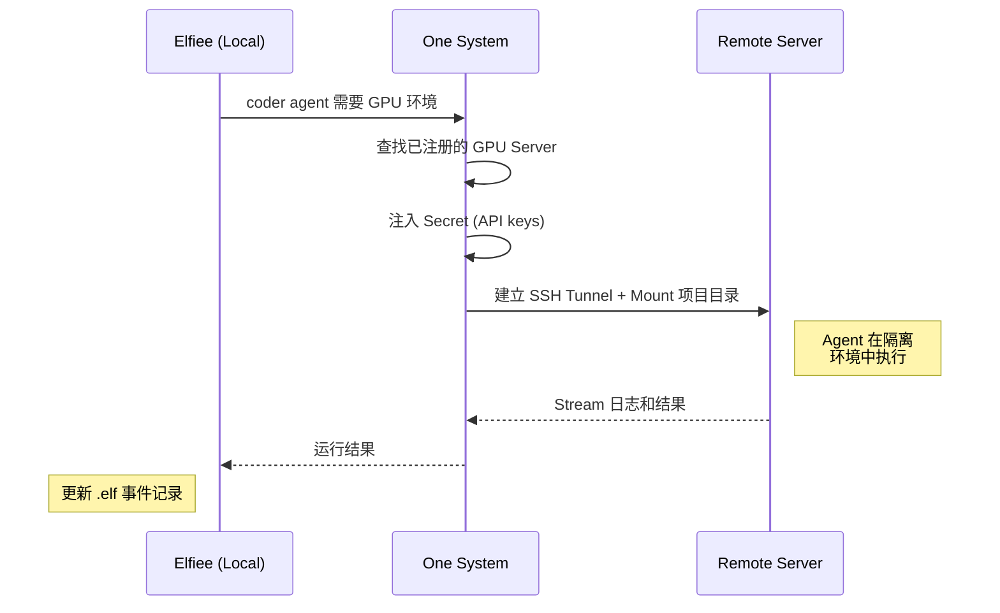

---

## 七、评估与建议

### 7.1 架构优势

1. **Matrix 作为消息总线是好的选择**：开放协议、联邦化、端到端加密、原生支持 Bot。比自建消息系统成本低且生态好。

2. **关注点分离清晰**：四个平台各司其职，没有功能重叠。社群归社群、通讯归通讯、智能归本地、资源归运行时。

3. **模板作为 Agent 组织的 "基因"**：`.elf` 文件天然适合这个角色——事件溯源提供审计，CBAC 提供权限隔离，Block 结构提供模块化。

4. **渐进式复杂度**：用户可以只用 Elfiee（纯本地），也可以接入 Matrix（协作），也可以发布到 Synnovator（社区），复杂度按需增长。

### 7.2 需要注意的风险

| 风险 | 描述 | 建议 |
|------|------|------|
| **Matrix 单点依赖** | 所有跨平台通讯都经过 Matrix，宕机影响全局 | 各平台保留直连 API（REST/gRPC），Matrix 是增强层不是必需层。Elfiee ↔ One System 的高频通讯（SSH 日志流）应走直连，不走 Matrix |
| **/命令爆炸** | Synnovator 功能多了以后 /命令数量失控 | 分层设计：高频简单操作走 /命令，复杂操作走 /open（在 Matrix 中打开 Synnovator 嵌入视图或链接） |
| **Agent 生命周期归属** | 模板定义在 Elfiee，运行时在 One System，入口在 Matrix——谁管生死？ | 明确：Elfiee 拥有 Agent **定义**（模板），Matrix 拥有 Agent **会话**（托管），One System 拥有 Agent **进程**（运行时）。生命周期由 Elfiee 模板声明，Matrix 和 One System 执行 |
| **模板版本演化** | 自我演化的模板需要版本管理和回滚 | Synnovator 模板市场做语义化版本，Elfiee 事件日志本身就是完整历史，可回溯任意时刻的模板状态 |
| **本地 ↔ 云端延迟** | Elfiee 在本地，One System/Matrix 在云端，复杂任务需要频繁通讯 | 区分实时路径和异步路径。实时：Elfiee ↔ One System SSH 直连。异步：通过 Matrix 消息队列 |

### 7.3 建议的实施优先级

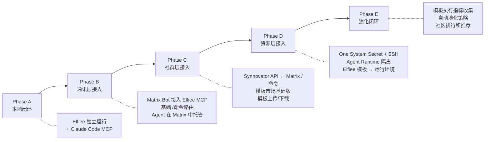