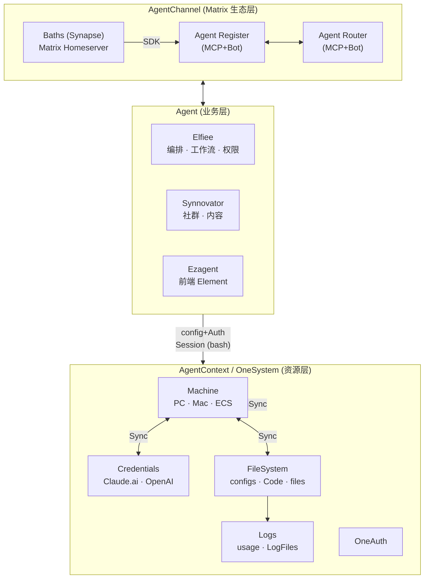
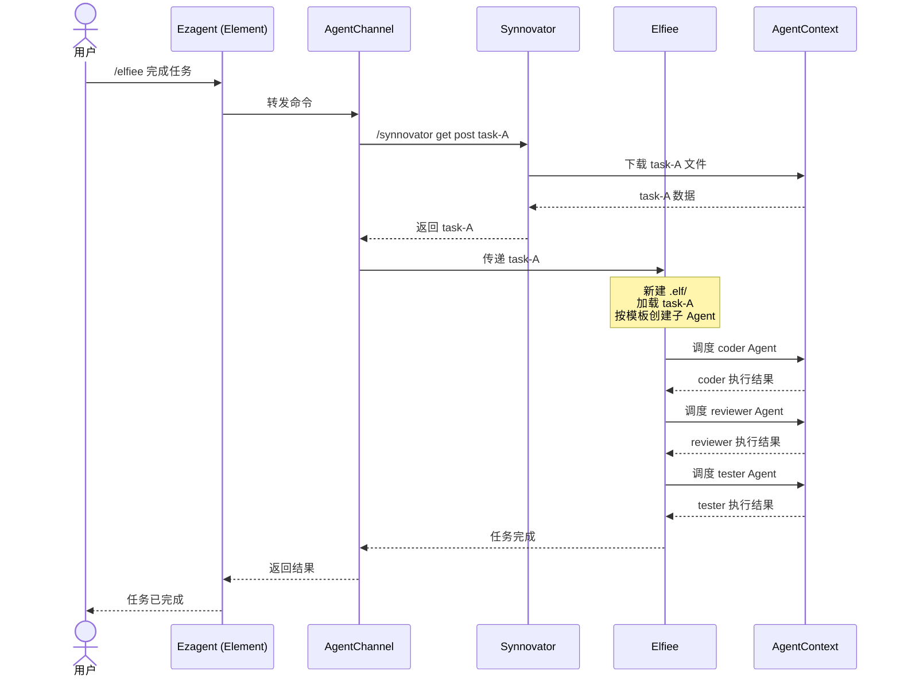
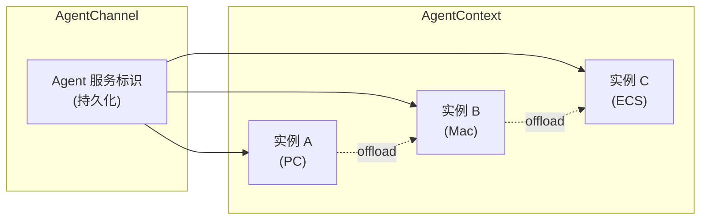

# Unified Framework v2: 四平台架构总结

> 基于 `frame.jpg` 讨论后的架构理解

## 一、架构分层



### 1.1 AgentChannel (Matrix 生态层)

**职责**：Agent 的注册与路由，消息转发

| 组件 | 说明 |
|------|------|
| **Baths (Synapse)** | Matrix Homeserver，通过 SDK 调用 Agent |
| **Agent Register** | 支持 MCP 和 Bot 两种注册类型，一般组合注册 |
| **Agent Router** | 路由决策：选择哪个资源实例响应请求（如 Claude 下的 haiku/opus/sonnet） |

**接口规范**（绿色部分）：
- **3PID / IM Server / Router**：Matrix 侧的身份和路由
- **slash/endpoint**：命令发送格式（`/elfiee xxx`）
- **Data Mode (MessageType)**：消息结构规范
- **MCP+Skill**：命令解析和执行

### 1.2 Agent (业务层)

**职责**：具体业务逻辑，可独立部署

| Agent | 说明 |
|-------|------|
| **Elfiee** | 编排型 Agent，管理 workflow、权限、子 Agent 配置。核心能力是 `.elf` 模板驱动的多 Agent 协作 |
| **Synnovator** | 社群平台，内容管理、模板市场 |
| **Ezagent** | 前端 Element，用户交互入口 |

**关键点**：
- 三者理论上都是独立的 Agent，或使用 Agent 的平台
- Elfiee 可被 Matrix 调用，也可独立本地运行
- 当前阶段 Elfiee 运行在本地，注册到 Channel 上

### 1.3 AgentContext / OneSystem (资源层)

**职责**：Agent 实例的运行环境，资源管理

| 组件 | 说明 |
|------|------|
| **OneAuth** | 鉴权：验证调用者是否有权限使用某 Agent/Credential |
| **Machine** | 计算资源：PC、Mac、ECS，支持同步和降级机制 |
| **Credentials** | 用户个人的 API Key（Claude.ai、OpenAI 等） |
| **FileSystem** | 配置文件、代码、数据文件 |
| **Logs** | 使用记录、日志文件 |

**关键点**：
- Agent 实例是常驻进程
- 支持 offload 到另一台 Machine（failover）
- 调度策略可由模板声明，也支持自动规则（如 leastLatency）

---

## 二、Elfiee 的角色

Elfiee 是一个 **编排型 Agent**，核心能力是定义和执行多 Agent 工作流。

### 2.1 模板结构

```
team-template.elf/
├── _eventstore.db              # 事件日志
├── agents/
│   ├── coordinator.md          # 协调者
│   ├── coder.md                # 编码者
│   ├── reviewer.md             # 审查者
│   └── tester.md               # 测试者
├── rules/
│   ├── workflow.md             # 工作流定义（DAG）
│   ├── permissions.md          # 权限矩阵
│   └── evolution-policy.md     # 演化策略
└── skills/
    ├── code-review.md          # 可复用 skill
    └── test-driven.md          # TDD 流程
```

### 2.2 典型工作流



### 2.3 子 Agent 的管理

- **编排流程存在 Elfiee 中**：workflow、权限、Agent 配置都在 `.elf` 模板里定义
- **子 Agent 是已注册的服务**：可能是云端拉取的，也可能是本地的，通过 Sync 同步 Context
- **Channel 上持久化，资源按需调度**：服务标识持久化，背后的计算资源可以启停、offload

---

## 三、Agent 实例与资源的关系



**关键点**：
- Channel 上注册的是持久化的服务标识
- 一个 Agent 可能对应多个实例资源
- Router 决定用哪个实例响应（基于延迟、负载、用户偏好等）
- 支持 offload 和 failover，保证服务可用性

---

## 四、接口规范

所有 Agent 共用一套接口：

| 层级 | 规范 | 说明 |
|------|------|------|
| 发送 | **slash/endpoint** | 命令格式，如 `/elfiee xxx` |
| 消息 | **Data Mode (MessageType)** | 消息结构定义 |
| 执行 | **MCP+Skill** | 命令解析和执行逻辑 |

**调用链路**：
1. 用户在 Ezagent (Element) 输入 `/elfiee 完成任务`
2. Matrix (Baths) 通过 SDK 调用 Agent Register
3. Agent Router 选择合适的 Elfiee 实例
4. Elfiee 通过 MCP+Skill 解析命令并执行
5. 结果沿原路返回

---

## 五、Credentials 与权限

- **Credentials 归属用户个人**：Claude.ai、OpenAI 等 API Key 存储在 AgentContext
- **OneAuth 负责鉴权**：验证调用者是否有权限使用某 Agent 或 Credential
- **权限隔离**：Agent A 不能使用 Agent B 的 Credentials，除非明确授权

---

## 六、当前阶段的简化

- **Elfiee 运行在本地**：注册到 Channel，但实例在用户电脑上
- **不考虑协同编辑**：用户关机后，其他用户访问的是服务器上的 Elfiee 实例（如有）
- **各平台可自部署**：Elfiee/Matrix/Synnovator 理论上都支持自托管，但当前先不讨论联邦架构
